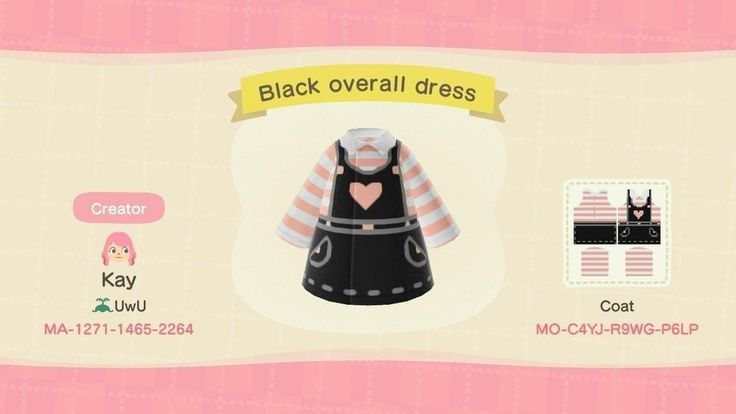
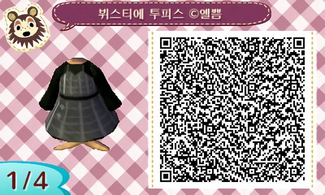

# Overview

This article breifly discusses about Custom Design used in Animal Crossing. 

# What is Custom Design

Custom Design is a design pattern such as clothes, wallpaper, and flooring that can be used in "Animal Crossing: New Horizon" and "Animal Crossing: New Leaf." Users can create a design they want and share it through a design ID, QR code, etc., and they can also import and use a design made by other users.

There are two versions of Custom Design: regular and professional. Custom Design can be used for wallpaper or flooring, and Custom Design Pro can be used for clothes and umbrellas.



An example of custom design

# Custom Design Structure

Custom Design can be used in both "Animal Crossing: New Horizon" and "Animal Crossing: New Leaf", so the structure in both games is the same. According to NHSE[^1], the structure of Custom Design looks like the following.

```cpp
struct ColorPalette
{
    u8 B;
    u8 G;
    u8 R;
};

bitfield Color
{
    first_color_choice : 4;
    second_color_choice : 4;
};

struct DesignPattern
{
    u32 hash;
    u32 version;
    padding[8];
    char design_name[40];
    u32 town_id;
    char town_name[20];
    padding[4];
    u32 player_id;
    char player_name[20];
    padding[12];
    ColorPalette color_palette[15];
    Color color_choices[512];
    padding[3];
};

struct DesignPatternPROSheet
{
    Color color_choices[0x200];
};

struct DesignPatternPRO
{
    u32 hash;
    u32 version;
    padding[8];
    char design_name[40];
    u32 town_id;
    char town_name[20];
    padding[4];
    u32 player_id;
    char player_name[20];
    padding[12];
    ColorPalette color_palette[15];
    DesignPatternPROSheet sheets[4];
    padding[3];
};
```

# How to Share Custom Design

Methods of sharing Custom Design and Custom Design PRO include using a design ID and a QR code. For both methods, you must be subscribed to Nintendo Switch Online. Specifically for the QR code method, you must have installed "Nintendo Switch Online" mobile application.

## Design ID

In order to use ID such as design ID, “Able Sisters tailor’s shop” should be opened. Then, you can upload designs using the "My Design Terminal" that exists in the store.

## QR code

After linking "Nintendo Switch Online" application installed on your smartphone with "Animal Crossing: New Horizon," you can download the design by scanning the QR code using your smartphone.

The QR codes can be created using sites such as ACPatterns[^2] or by using "Animal Crossing: New Leaf" from 3DS.


An example of custom design QR code

# QR code Analysis

A good reference for QR code analysis is acpatterns-js[^3] by DamSenViet.

[^1]: https://github.com/kwsch/NHSE
[^2]: https://acpatterns.com/
[^3]: https://github.com/DamSenViet/acpatterns-js