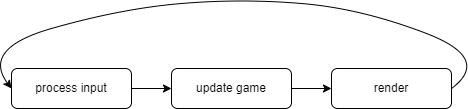

# 개요

일반적으로 게임은 하나의 메인 루프에서 다음과 같은 기능을 수행하는 함수들을 호출한다.

- process input
- update game (event)
- render



이 글에서는 닌텐도 스위치 게임에서 main loop로 가는 과정과, 스위치 게임의 동작 방식을 간략 서술한 글이다.

## 분석 이유


게임 동작 방식을 분석한 이유는 다음과 같다.

1. 다른 게임을 분석할 때 조금이라도 편하게 분석하기 위해서
    1. 스위치에서 게임이 돌아가는 방법에 대한 큰 그림을 그릴 수 있다.
    2. 다른 게임을 분석하더라도 그 게임은 다른 게임과 유사하게 돌아간다. 따라서 더 편하게 분석할 수 있을 것이라고 예상하였다.
        1. 게임에서 멀티 쓰레딩이 어떻게 돌아가는 지를 확인할 수 있다.
2. 이론상 main loop를 분석하는 것으로 게임에서 사용하는 모든 함수(기능)을 분석하는 것이 가능하다.
    1. 특정 기능에 대한 함수를 찾을 수 없다면 시간이 오래 걸리더라도, main loop에서 각 함수로 도달할 수 있다.
  
# main loop 탐색


## nnMain 이전


이 부분은 바이너리에 포함되지 않는다. 하지만 nnMain을 호출하는 루틴은 있는 것으로 보이며, 그 루틴 중에 함수를 찾는 부분인 것 같은 부분이 존재한다.


```
v31 = ((__int64 (__fastcall *)(__int64 *, const char *))unk_80000750)(
                    v30,
                    "_ZN2nn2ro6detail15g_pAutoLoadListE");
if ( v31 && *(unsigned __int8 *)(v31 + 4) >= 0x10u )
  *(_QWORD *)(*(_QWORD *)(v31 + 8) + v30[4]) = &qword_800053E0;
v32 = ((__int64 (__fastcall *)(__int64 *, const char *))unk_80000750)(
        v30,
        "_ZN2nn2ro6detail17g_pManualLoadListE");
if ( v32 && *(unsigned __int8 *)(v32 + 4) >= 0x10u )
  *(_QWORD *)(*(_QWORD *)(v32 + 8) + v30[4]) = qword_800053D0;
v33 = ((__int64 (__fastcall *)(__int64 *, const char *))unk_80000750)(
        v30,
        "_ZN2nn2ro6detail14g_pRoDebugFlagE");
if ( v33 && *(unsigned __int8 *)(v33 + 4) >= 0x10u )
  *(_QWORD *)(*(_QWORD *)(v33 + 8) + v30[4]) = 21488LL;
v34 = ((__int64 (__fastcall *)(__int64 *, const char *))unk_80000750)(
        v30,
        "_ZN2nn2ro6detail34g_pLookupGlobalAutoFunctionPointerE");
if ( v34 && *(unsigned __int8 *)(v34 + 4) >= 0x10u )
  *(_QWORD *)(*(_QWORD *)(v34 + 8) + v30[4]) = 1684LL;
result = ((__int64 (__fastcall *)(__int64 *, const char *))unk_80000750)(
           v30,
           "_ZN2nn2ro6detail36g_pLookupGlobalManualFunctionPointerE");
if ( result && *(unsigned __int8 *)(result + 4) >= 0x10u )
  *(_QWORD *)(*(_QWORD *)(result + 8) + v30[4]) = 21496LL;
```

## nnMain ~ main loop 까지과정

---

스위치의 모든 어플리케이션은 nnMain이 프로그램의 시작 함수이(따라서 *이론상* nnMain에서 top-down 방식으로 탐색하는 것으로 모든 함수를 탐색할 수 있다). 일반적인 nnMain은 다음과 같은 모양을 띄고 있다. 


```
void __fastcall __noreturn nnMain(Lp::Sys::SysInit *this, const char *a2)
{
  *(_QWORD *)off_82FA6FC0 = &off_82D82120;
  Lp::Sys::SysInit::Init(this, a2);
}
```

여기서 Lp::Sys::SysInit::Init 함수를 통해 게임에서 사용하는 각종 설정하고, sead::Framework::run를 호출한다.


```
Lp::Sys::SysInit::Init(const char* x)
{
// ...
	return framework->sead::Framework::run(framework, ?, ?, ?)
}
```

sead::Framework::run에서는 다시 sead::GameFrameworkNx::runImpl_를 호출한다.


```
sead::Framework::run(?, ?, ?)
{
// ...
	sead::GameFrameworkNx::runImpl_();
	return sead::GameFramework::quitRun_();
}
```

sead::GameFrameworkNx::runImpl_는 다음과 같다. sead::GameFramework::waitStartDisplayLoop_함수는 각종 


```
sead::GameFrameworkNx::runImpl_(void)
{
// ...
  v2 = sead::GameFramework::waitStartDisplayLoop_();
// ...
  return sead::GameFrameworkNx::mainLoop_();
}
```

여기서 sead::GameFrameworkNx::mainLoop_은 다음과 같이 생겼고, 형태를 보면 알 수 있듯 main loop이다.


```
sead::GameFrameworkNx::mainLoop_(void)
{
  while ( 1 )
    Lp::Sys::Framework::procFrame_();
}
```

## 요약 그림

---


# main loop(Thread) 분석

---

main loop에서 호출하는 함수인 Lp::Sys::Framework::procFrame_은 sead::GameFrameworkNx::procFrame_ 함수를 호출하고, sead::GameFrameworkNx::procFrame_ 함수는 다음과 같이 생겼다.

```
sead::GameFrameworkNx::procFrame_(void)
{
// ...
  sead::TaskMgr::afterCalc(task_manager_);
  sead::GameFrameworkNx::procDraw_();
  sead::GameFrameworkNx::procCalc_();
  sead::Framework::procReset_();
  v3 = sead::GameFrameworkNx::waitForGpuDone_();
// ...
}
```

Lp::Sys::Framework::procFrame_ 함수를 포함하여, Lp::Sys::Framework::procFrame_ 함수에서 호출하는 함수들의 역할은 다음과 같다.

- Lp::Sys::Framework::procFrame_ → 매 프레임마다 게임을 갱신하는 함수(sead::GameFrameworkNx::procFrame_) 호출
    - sead::GameFrameworkNx::procFrame_ → 매 프레임마다 게임 갱신
- sead::TaskMgr::afterCalc → tasks를 모두 끝낸 후, post-processing을 진행
- sead::GameFrameworkNx::procDraw_ → Render를 수행하는 task 생성
- sead::GameFrameworkNx::procCalc_ → 실제 task를 수행
    - sead::TaskMgr::beforeCalc → task를 생성
- sead::Framework::procReset_ → task 초기화

Render를 수행하는 부분을 제외하고 각 함수의 동작은 다음과 같다.

- Lp::Sys::Framework::procFrame_ → **Update the game every frame (call sead::GameFrameworkNx::procFrame_)**
    - sead::GameFrameworkNx::procFrame_
- sead::TaskMgr::afterCalc → **After you finish the task, proceed with post-processing**
- sead::GameFrameworkNx::procDraw_ → **Create tasks to perform with the Render**
- sead::GameFrameworkNx::procCalc_ → **Perform actual tasks**
    - sead::TaskMgr::beforeCalc → **Create task**
- sead::Framework::procReset_ → **Task initialization**

## sead::TaskMgr::afterCalc


이 함수는 바로 sead::TaskMgr::calcDestruction_를 호출한다. sead::TaskMgr::calcDestruction_ 함수는 Task 목록을 순회하며, 작업이 종료된 Task는 목록에서 제거한다. 그리고 Task를 모두 없앤다.

## sead::GameFrameworkNx::procCalc_

---

이 함수에서는 sead::TaskMgr::beforeCalc 함수를 통해 Task를 생성한다. 그리고 sead::SingleScreenMethodTreeMgr::calc → sead::MethodTreeNode::call 함수를 통해 각 Delegate를 invoke한다. 즉, 실제 Task를 수행하게 하는 함수이다.


이 함수에서 호출되는 Delegate들은 다음과 같다.


- sead::Delegate<Lp::Net::EnlTask>
- sead::Delegate<Lp::Sys::DbgCameraMgr>
- sead::Delegate<Lp::UI::UIMgr>
- sead::Delegate<gsys::SystemTask>
- sead::Delegate<sead::CalculateTask>
- sead::Delegate<sead::MethodTreeNode>

여기서 invoke된 Task들은 Main Thread에서 수행된다. 또한, 이 함수에서는  sead::FixedSizeJQ::enque 함수와 sead::FixedSizeJQ::run 함수도 호출한다.  sead::FixedSizeJQ::enque 함수는 작업을 JobQueue에 추가하는 함수이고, sead::FixedSizeJQ::run 함수는 JobQueue에 있는 함수들을 수행하는 함수이다.


## sead::Framework::procReset_


모든 Task가 완료될 때까지 기다린 후, 모든 Task를 지우고 새로운 Root Task를 추가한다.


## 요약 그림


# Main thread의 Delegate 분석


Delegate는 Multi-Threading 환경에서 사용될 수 있으며 Callback 구현이나 Event-Driven multi-Threading 구현 등에서 사용될 수 있다. 닌텐도 스위치에서 사용하는 Delegate 중 Main Thread에서 호출되는 Delegate의 종류는 다음과 같다.


- Lp::Net::EnlTask
- Lp::Sys::DbgCameraMgr
- Lp::UI::UIMgr
- gsys::SystemTask
- sead::CalculateTask
- sead::MethodTreeNode

이 섹터에서는 각 타입의 Delegate가 호출하는 함수들을 간략히 분석한다.

## sead::Delegate<Lp::Net::EnlTask>


이 타입의 Delegate를 통해 호출되는 함수는 다음과 같다.

- Lp::Net::EnlTask::calcAfterScene

Lp::Net::EnlTask::calcAfterScene 함수는 다음과 같이 생겼다.


```
__int64 Lp::Net::EnlTask::calcAfterScene()
{
  default_content_transport_manager_->Lp::Net::ContentTransporterMgrBase::calcAfterScene(default_content_transport_manager_);
  Lp::Net::PiaCloneMgr::calcSend(*Lp::Net::PiaCloneMgr::sInstance);
  Lp::Net::PiaChatMgr::calcMainThread(*Lp::Net::PiaChatMgr::sInstance);
  enl::Framework::calcSend(this->framework_);
  return default_matching_sequence_->Lp::Net::DefaultMatchingSeq::calcAfterScene(default_matching_sequence_);
}
```

## sead::Delegate<gsys::SystemTask>


- gsys::SystemTask::postDrawTV_
- gsys::SystemTask::postCalc_
- gsys::SystemTask::preCalc_
- gsys::SystemTask::drawTV_

이 Delegate에서 호출되는 함수들은 그래픽 렌더링과 관련된 함수이다(gsys는 graphic system의 약어로 추측된다).


## sead::Delegate<sead::CalculateTask>


- Lp::Sys::CtrlMgr::calc
- Cmn::BcatMgr::calc
- Lp::Sys::DbgMode::calc
- Lp::Sys::XLinkMgr::calc
- Cmn::DbgMapVisitor::calc
- Cmn::SceneLoadDispMgr::calc
- Cmn::OEFocusHandlingModeChanger::calc
- Cmn::SoundMgr::calc
- Lp::Net::EnlTask::calc
- Lp::Sys::MemProfiler::calc
- Lp::Sys::ProcessSwitch::calc
- sead::ControllerMgr::calc
- Cmn::PBRPrepareTask::calc
- Cmn::CoconutMgr::calc
- Lp::Sys::SaveDataMgr::calc
- Cmn::DayChangeChecker::calc
- Lp::Sys::Nfp::calc
- Lp::Sys::WarningMgr::calc
- Lp::Sys::LuaMgr::calc
- Cmn::Pause::calc
- Lp::Sys::RootTask::calc
- Lp::UI::UIMgr::calc
- Lp::Sys::TimeStamp::calc
- Cmn::SceneBasePostGsysCalcTask::calc
- Cmn::CtrlChecker::calc
- Lp::Sys::DbgTextWriter::calc
- Cnet::NexMaintenanceChecker::calc
- Lp::Sys::RumbleMgr::calc
- Lp::Sys::PauseMgr::calc
- Lp::Sys::SoundMgr::calc
- Lp::Sys::FuncForShow::calc
- Cmn::GPUFootPrintCalcForProduct::calc
- Lp::Sys::SceneMgr::calc
- Cmn::OekakiMgr::calc
- Lp::Sys::EffectMgr::calc

## sead::Delegate<sead::MethodTreeNode>


어떤 함수도 sead::MethodTreeNode에서 호출되지 않는다.

## sead::Delegate<Lp::Sys::DbgCameraMgr>


Lp::Sys::DbgCameraMgrDelegate에선 어떤 함수도 호출되지 않는다.

## sead::Delegate<Lp::UI::UIMgr>

---

Lp::UI::UIMgr에선 어떤 함수도 호출되지 않는다.

# JobQueue & WorkerMgr/Worker Thread

---

Multi-Threading을 지원하는 대부분의 게임은 Job(Task) System을 통해 Multi-Threading을 구현한다. Job System은 해야 할 작업들을 Queue에 넣어두고, 각 Thread가 ead::FixedSizeJQ::run 함수를 통해 Job(Task) Queue에 있는 작업들을 수행하는 방식으로 구현된다.


닌텐도 스위치에 존재하는 Thread의 목록은 다음과 같다.

- AppletThread
- Bcat
- LibcurlResolver
- Lp::Sys::VibrationThread
- Nfp
- Pia BackgroundScheduler
- Prepare Thread
- Presentation Thread
- SaveDataMgr
- SceneGeneralMain
- SceneGeneralSub1
- SceneGeneralSub2
- SceneLoad
- SceneLoadInCalc
- SoundCalcCallerAsLongBlock
- Thread 72
- Thread 79
- UIJob
- UpdateTextureCacheThread
- VibrationThread
- WorkerMgr/Worker1(?)
- WorkerMgr/Worker2(?)
- aal::LowPrioWorkerThread
- enl::TaskThread
- nn::atk::detail::TaskThread
- nn::atk::detail::driver::SoundThread

닌텐도 스위치에서 Thread의 이름이 있는 경우, 해당 이름에 알맞은 작업을 수행한다. 하지만, Worker Thread의 경우 다음과 같은 작업들을 수행한다.

- Lp::Sys::CalcInGSysCalc::CalcInGSysCalc_DefaultJob::invoke
- agl::lyr::LayerJob::invoke
- gsys::ModelJobQueue::Job::invoke:
- gsys::ModelRenderQueue::invoke
- gsys::ModelScene::Job::invoke
- gsys::ParticleMgr::ParticleCalcJob::invoke
- gsys::SystemJob::invoke
- sead::Job0<Lp::Sys::Actor>::invoke

여기서 gsys가 포함된 작업들은 그래픽과 관련된 작업이므로 무시하고 LayerJob의 경우에도 그래픽과 관련된 작업이므로 무시하면, 다음 작업이 남는다.


- sead::Job0<Lp::Sys::Actor>::invoke

위 함수는 곧바로 sead::Delegate<Lp::Sys::Actor>::invoke 함수를 호출하고, sead::Delegate<Lp::Sys::Actor>::invoke 함수는 다음 함수를 호출한다.


- Lp::Sys::Actor::actorSysCalc

그림으로 표현하면 다음과 같다.


## Actor

---

Actor는 플레이어나 AI 등에 의해 제어될 수 있는 개체와 관련되어 있음을 의미한다. 즉, 위에서 발견한 Lp::Sys::Actor::actorSysCalc 함수는 이러한 개체들과 관련된 연산을 수행하는 함수임을 알 수 있다.이 함수에서는 3개의 함수를 호출한다.

**Actor means that it is related to an object that can be controlled by a player or AI. In other words, it can be seen that the Lp::Sys::Actor::factorSysCalc function found above is a function that performs operations related to these entities.This function calls three functions.**

- Cmn::Actor::actorCalc
- Lp::Sys::Actor::actorSysCalc
- Cmn::Actor::actorCalc_PostChildCalcByThis

여기서 중요한 함수는 Cmn::Actor::actorCalc 함수이다. 이 함수는 다음과 같이 생겼다.


```
Lp::Sys::Actor* Cmn::Actor::actorCalc(int step)
{
// ...
  switch ( step )
  {
    case 0:
      Game::NpcBase::firstCalc();
      if ( component_holder_ )
      {
        component_holder_->Cmn::Actor::actorDestroy();
      }
      break;
    case 1:
      Game::Actor::secondCalc();
      if ( component_holder_ )
      {
        component_holder_->Cmn::Actor::actorCalc();
      }
      break;
    case 2:
      Game::NpcBase::thirdCalc();
      if ( component_holder_ )
      {
        component_holder_->Cmn::Actor::actorCalc_PostChildCalcByThis();
      }
      break;
    case 3:
      if ( component_holder_ )
        component_holder_->Cmn::ComponentHolder::preFourthCalc(component_holder);
      Game::NpcBase::fourthCalc();
      if ( component_holder_ )
      {
        component_holder_->Cmn::Actor::actorDbgDraw2D();
      }
      break;
    case 4:
      component_holder_->Cmn::Actor::fifthCalc();
      break;
    case 5:
      this = (Lp::Sys::Actor *)this->vtable_->Cmn::Actor::isCalcXLink(this);

      if ( ((Cmn::Actor::isCalcXLink() & 1) != 0 )
      {
        Cmn::Actor::xlinkCalc();
        if ( x_link_ )
        {
          x_link_->Lp::Sys::XLink::calc();
        }
      }
      break;
    default:
      return this;
  }
  return this;
}
```

이 함수에서는 단계에 따라 상호작용 가능한 개체와 관련된 연산을 수행한다. 따라서 이 함수에서 데미지 계산 등의 동작을 수행한다.
