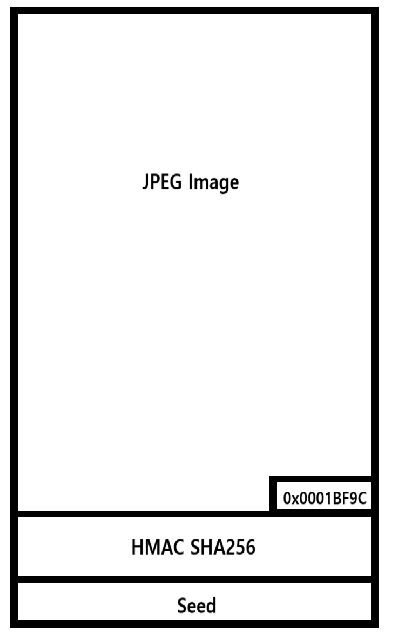

# Overview

This article talks about the structure of thumbnail files used in Super Mario Maker 2.

# Structure

## Encrypted Structure

The thumbnail file is generated at the same time the Course is created, and is encrypted like the Course. 

```cpp
struct EncrpytedThumbnail
{
	struct EncrpytedData encrpyted_data;
	struct EncryptionConfig encryption_config;
}

struct EncryptedData
{
	char data[0x1BFD0];
}

struct EncrpytionConfig
{
	u32 aes_iv[4];
	u32 random_seed[4];
	u32 aes_cmac_over_decrpyted_file[4];
}
```

## Actual Structure

The above structure is summarized as follows.

Like the Course file, the thumbnail file has a fixed size of 0x1BFD0 bytes. It follows a JPEG format with Hash and Seed values added for integrity check.



```cpp
struct Thumbnail // size is always 0x1BFD0
{
	char jpeg_data[0x0001BF9C];
	int size_of_jpeg_data; // this is always 0x0001BF9C
	char hmac_sha256_of_jpeg_data[0x20];
	char seed_for_hmac_sha256[0x10];
}
```

# File Format Check

In order to use any thumbnail file for Super Mario Maker 2, the file format must be matched. Below is a description of the process.

## Key Check

A key value used for the authenticating HMAC may be calculated through the seed of the thumbnail file format. The calculation code is as follows.

```cpp
def generate_hash_key(rand: sead.Random):
		fixed_value = [0x39B399D2, 0xFAE40B38, 0x851BC213, 0x8CB4E3D9, 
		            0x7ED1C46A, 0xE8050462, 0xD8D24F76, 0xB52886FC, 
		            0x67890BF0, 0xF5329CB0, 0xD597FB28, 0x2B8EE0EA, 
		            0x47574C51, 0xF7569D9, 0xCF1163AE, 0xE4A153BF, 
		            0xD1FAE468, 0xD4C64738, 0x360106F5, 0xDD7EB113, 
		            0xC296F3E2, 0x2C58F258, 0x79B554E1, 0x85DF9D06, 
		            0xAA307330, 0x1410F69, 0xB2F2C573, 0x82B93EB1, 
		            0xF351A11C, 0x63098693, 0x885B5DA5, 0x8872A8ED, 
		            0xACD9CB13, 0xED7FBCAD, 0xE6A41EC2, 0x5F44E79F, 
		            0x8346F5B5, 0x389FE6ED, 0x507124B5, 0xE9B23EAA, 
		            0x577113F0, 0xA95ED917, 0x2F62D158, 0x47843F86, 
		            0xC65637D0, 0x2F272052, 0xBA4A4CC4, 0xB5F146F6, 
		            0x501B87A7, 0x51FC3A93, 0x6EDE3F02, 0x3D265728, 
		            0x9B809440, 0x75B89229, 0xF6A280CC, 0x8537FA68, 
		            0x5B5ED19A, 0x6FC05BB6, 0xF4EF5261, 0xAA1B7D4F, 
		            0xFCB26110, 0xAD3D74, 0xC0E73A4B, 0xF132E7C7]
		hmac_key = [0, 0, 0x82A28C10, 0, 1]
		
		for i in range(4):
		    for _ in range(3):
		        t = fixed_value[(rand.u32() >> 26)&0xffffffff]
		        hmac_key[i] = ((t >> ((rand.u32() >> 27) & 0x18)) & 0xff | hmac_key[i]) << 8
		    t = fixed_value[(rand.u32() >> 26)&0xffffffff]
		    hmac_key[i] = ((t >> ((rand.u32() >> 27) & 0x18)) & 0xff | hmac_key[i]) & 0xffffffff
		
		return struct.pack('<IIII', hmac_key[0], hmac_key[1], hmac_key[2], hmac_key[3])
```

## SHA-256 with HMAC

The SHA-256 with HMAC may use Nintendo's own standard, so it cannot be calculated without analyzing the calculation method. Therefore, it is necessary to reproduce it in the following way.

1. Reverse engineer the SDK attached with the game to achieve the same behavior
2. Make functions included in SDK to be executable
3. Use libnx[^1] from Switchbrew

# Encryption

In order to overwrite the thumbnail on the actual save file, the thumbnail should be encrypted. The encryption process is published on Ji Xiaomai's github[^2].

SMM2 Course Encryption and Decryption Method is described in detail [here](../Course_Analysis/Course_Encryption_Decryption/).

[^1]: https://github.com/switchbrew/libnx
[^2]: https://github.com/JiXiaomai/SMM2