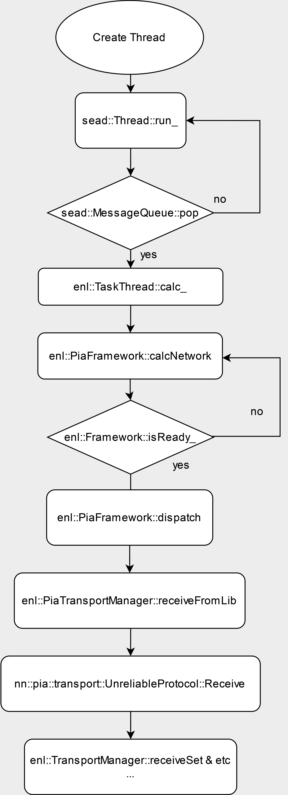

# Enl Task Thread Analysis


**The analysis below was conducted in Splatoon 2.**

# Overview

This article talks about how ENL Task Thread works.

# Packet receive




# **ENL Task Thread**

Thread processing ENL related tasks

```jsx
sead::Thread::run_ → messageQueuepop -> ...
-> enl::TaskThread::calc_ -> enl::PiaFramework::dispatch → *
```

It is executed in the above order and processes packets sequentially.

```jsx
nn::pia::transport::ProtocolManager::Dispatch 
-> nn::pia::transport::StationProtocol::Dispatch
-> nn::pia::transport::StationProtocol::ParseMsgFromReliable 
-> nn::pia::transport::StationProtocolReliable::Receive
```

For example, when accessing a room, it is processed as follows.

```jsx
nn::pia::transport::ConnectStationJob::SendConnectionRequest
-> nn::pia::transport::ConnectStationJob::SendConnectionRequestMessage 
-> nn::pia::transport::StationProtocol::MakeConnectionRequestData 
-> ( nn::pia::transport::StationConnectionInfo::GetSerializedSize = 0x46 sz ) & ( nn::pia::transport::StationConnectionInfo::Serialize) 
-> nn::pia::transport::StationLocation::Serialize (Little <-> Big)
```

### ****unreliable protocol session search****

The unreliable protocol that was analyzed using 1-day vulnerability is processed in this thread.

It is sometimes processed in another thread as well.

```jsx
... -> sead::Thread::run_ -> enl::TaskThread::calc_ 
-> sead::Delegate1R<enl::MatchingManager,void *,enl::Result>::invoke 
-> enl::MatchingManager::callfindMatch -> enl::PiaLocalMatchingManager::findMatch 
->  enl::PiaLocalMatchingManager::matchmake_
```

After the function calls above, the function called within the matchmake, enl::PiaLocalMatchingManager::prepareSession_, initializes the session, and enl::PiaLocalMatchingManager::procSessionEvent_ invokes enl::PiaUtil::JoinSession, enl::PiaUtil::SearchSession, and enl::PiaUtil::CreateSession functions using a switch case.

During the session search process, the function calls occur as follows:

```jsx
enl::PiaUtil::SearchSession -> enl::PiaFramework::dispatch 
-> nn::pia::common::Scheduler::Dispatch -> nn::pia::common::Job::Execute 
-> nn::pia::transport::Transport::DispatchJob::ExecuteCore 
-> nn::pia::transport::Transport::dispatch 
-> nn::pia::transport::ProtocolManager::Dispatch 
-> nn::pia::transport::UnreliableProtocol::Dispatch
```

## **Pia class Serialize & Deserialize**


```c
_BYTE *__fastcall nn::pia::common::serializeU64(_BYTE *this, unsigned __int8 *a2)
{
  *this = HIBYTE(a2);
  this[1] = BYTE6(a2);
  this[2] = BYTE5(a2);
  this[3] = BYTE4(a2);
  this[4] = BYTE3(a2);
  this[5] = BYTE2(a2);
  this[6] = BYTE1(a2);
  this[7] = (_BYTE)a2;
  return this;
}
unsigned __int64 __fastcall nn::pia::common::deserializeU64(nn::pia::common *this, const unsigned __int8 *a2)
{
  return _byteswap_uint64(*(_QWORD *)this);
}

```

It performs Little to Big Endian conversion and vice versa.
