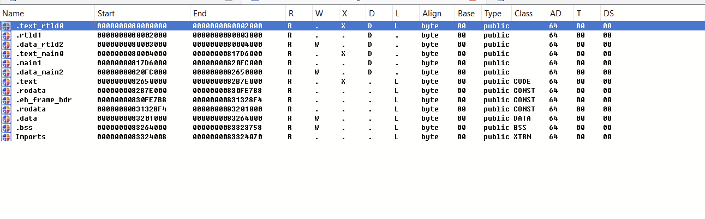

# Table of Contents
- [Table of Contents](#table-of-contents)
- [SwitchMapper](#switchmapper)
  - [Features](#features)
  - [Usage](#usage)


# SwitchMapper

When using the disassembler to analyze Nintendo Switch games, the segment mapping is incomplete because main, rtld, and sdk are loaded together. To solve this problem, you need to manually convert them to the correct segments. To do this easily, we have developed this tool.

## Features

Resets the permissions and addresses of the main, rtld, and sdk segments that are loaded into memory.

## Usage

Write the desired section name in the [`target`](./src/switch_mapper.py) in `main`.

```python
target = ['Section 1 Name','Section 2 Name','Section 3 Name','Section 4 Name']
```
> [!IMPORTANT]
> If the binary is 64 bit, [`s.bitness`](./src/switch_mapper.py) in Mapper.go() must be 0x2(64 bit) and it must be 0x1(32 bit) when the binary is 32 bit.

Then attach the game you want to analyze and run the tool through the "script file" tab to get the segments mapped correctly.

> [!IMPORTANT]
> 1. Memory segments must be deleted before using Mapper. 
> 2. Rebase before using it.
> 3. Before detaching the debugger, Take memory snapshop.

As a side note, it also works fine if you use it after an attach without loading any binaries. And you can use this on IDA 32bit.

