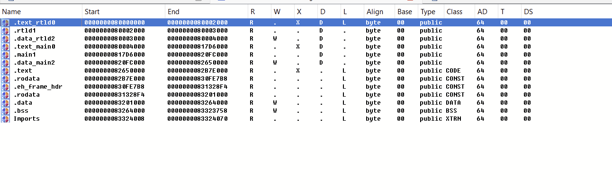

# SwitchMapper

Nintendo Switch 게임을 분석하기 위해 디스어셈블러를 사용할 때 main, rtld, sdk가 같이 로드되어 세그먼트 매핑이 불완전하다. 해당 문제를 해결하기 위해 직접 올바른 세그먼트로 변환해주어야 한다. 이를 용이하게 하기 위해 해당 툴을 개발하였다.

## 기능

불완전하게 메모리 상에 로드되는 main, rtld, sdk 세그먼트의 권한과 주소를 재설정 해준다.

## 사용법

target에 원하는 섹션 이름을 적어준다.

```python
target = ['Section 1 Name','Section 2 Name','Section 3 Name','Section 4 Name']
```

그 뒤, 분석할 게임을 attach한 후 “script file” 탭을 통해 해당 툴을 사용하면 정확하게 세그먼트가 매핑된다.


> [!IMPORTANT]
> 1. Mapper를 사용하기 전 Memory 세그먼트를 삭제해야한다. 
> 2. rebase를 진행한 후 사용해야한다.

여담으로, 아무런 바이너리를 로드하지 않고 어태치 후에 사용해도 정상 작동한다.

