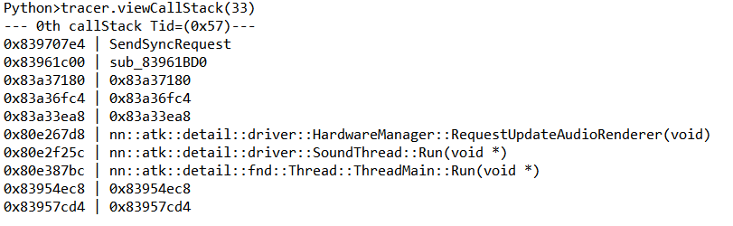

# Table of Contents
- [Table of Contents](#table-of-contents)
- [Syscall Tracer](#syscall-tracer)
  - [Overview](#overview)
  - [Features](#features)
  - [Usage](#usage)
  - [How to find syscall wrapper](#how-to-find-syscall-wrapper)
  - [Trouble shooting](#trouble-shooting)


# Syscall Tracer

## Overview

```C++
__int64 __fastcall nn::sf::hipc::Receive(_BYTE *a1, int a2, __int64 a3, __int64 a4)
{
  __int64 result; // x0
  char v6[4]; // [xsp+Ch] [xbp-14h] BYREF
  int v7; // [xsp+18h] [xbp-8h] BYREF
  char v8[4]; // [xsp+1Ch] [xbp-4h] BYREF

  v7 = a2;
  if ( _ReadStatusReg(ARM64_SYSREG(3, 3, 13, 0, 3)) != a3 )
  {
    LODWORD(result) = sub_710037ECEC(v6, a3, a4, &v7, 1LL, 0LL, -1LL);
    if ( (_DWORD)result )
      goto LABEL_3;
LABEL_6:

_DWORD *__fastcall sub_710037ECEC(_DWORD *result, int a2)
{
  __asm { SVC             0x44 ; 'D' }
  *result = a2;
  return result;
}

```

```
.text:000000710037ECE8                 RET
.text:000000710037ECE8 ; End of function sub_710037ECD4
.text:000000710037ECE8
.text:000000710037ECEC
.text:000000710037ECEC ; =============== S U B R O U T I N E =======================================
.text:000000710037ECEC
.text:000000710037ECEC
.text:000000710037ECEC ; _DWORD *__fastcall sub_710037ECEC(_DWORD *result, int)
.text:000000710037ECEC sub_710037ECEC                          ; CODE XREF: nn::sf::hipc::Receive(bool *,nn::svc::Handle,void *,ulong)+44↑p
.text:000000710037ECEC                                         ; nn::sf::hipc::Receive(nn::sf::hipc::ReceiveResult *,nn::svc::Handle,void *,ulong)+44↑p ...
.text:000000710037ECEC
.text:000000710037ECEC var_10          = -0x10
.text:000000710037ECEC
.text:000000710037ECEC                 STR             X0, [SP,#var_10]!
.text:000000710037ECF0                 SVC             0x44 ; 'D'
.text:000000710037ECF4                 LDR             X2, [SP,#0x10+var_10]
.text:000000710037ECF8                 STR             W1, [X2]
.text:000000710037ECFC                 ADD             SP, SP, #0x10
.text:000000710037ED00                 RET
.text:000000710037ED00 ; End of function sub_710037ECEC
.text:000000710037ED00
.text:000000710037ED04
.text:000000710037ED04 ; =============== S U B R O U T I N E =======================================
.text:000000710037ED04
.text:000000710037ED04
.text:000000710037ED04 ; _DWORD *__fastcall sub_710037ED04(_DWORD *result, _DWORD *, int)
.text:000000710037ED04 sub_710037ED04                          ; CODE XREF: .text:000000710032EAC8↑p
.text:000000710037ED04
.text:000000710037ED04 var_10          = -0x10
.text:000000710037ED04 var_8           = -8
.text:000000710037ED04
.text:000000710037ED04                 STP             X0, X1, [SP,#var_10]!
.text:000000710037ED08                 SVC             0x45 ; 'E'
.text:000000710037ED0C                 LDR             X3, [SP,#0x10+var_10]
.text:000000710037ED10                 STR             W1, [X3]
.text:000000710037ED14                 LDR             X3, [SP,#0x10+var_8]
.text:000000710037ED18                 STR             W2, [X3]
.text:000000710037ED1C                 ADD             SP, SP, #0x10
.text:000000710037ED20                 RET
.text:000000710037ED20 ; End of function sub_710037ED04
.text:000000710037ED20
.text:000000710037ED24
.text:000000710037ED24 ; =============== S U B R O U T I N E =======================================
.text:000000710037ED24
.text:000000710037ED24
.text:000000710037ED24 ; void sub_710037ED24()
.text:000000710037ED24 sub_710037ED24                          ; CODE XREF: nn::os::detail::UnsafeMemoryManagerImplByHorizon::AllocateUnsafeMemoryImpl(ulong *,ulong)+60↑p
.text:000000710037ED24                 SVC             0x48 ; 'H'
.text:000000710037ED28                 RET
.text:000000710037ED28 ; End of function sub_710037ED24
.text:000000710037ED28
.text:000000710037ED2C
.text:000000710037ED2C ; =============== S U B R O U T I N E =======================================
.text:000000710037ED2C
.text:000000710037ED2C
.text:000000710037ED2C ; void sub_710037ED2C()
.text:000000710037ED2C sub_710037ED2C                          ; CODE XREF: nn::os::detail::UnsafeMemoryManagerImplByHorizon::AllocateUnsafeMemoryImpl(ulong *,ulong)+EC↑p
.text:000000710037ED2C                                         ; .text:0000007100328EEC↑p
.text:000000710037ED2C                 SVC             0x49 ; 'I'
.text:000000710037ED30                 RET
```

When you run a game on Nintendo Switch, the SDK is also loaded into memory. It acts as a kind of library. In the SDK area, there is a series of syscall wrapper functions.

I developed this script because I thought that if I could see which functions were calling these funtions, I could figure out which functions were using which features.

## Features

1. Syscall wrapper exists in the Nintendo SDK area. Automatically recognize the syscall wrappers as the syscall function and rename it.
2. Set a BP, assign a callback function to the BP to collect the callstack for all functions that call the wrapper function and save the result in advance.
3. Retrieve the results, or revert to the original state after tracing.

## Usage

1. Run a game
2. GDB attach using ida
3. Edit → Segments → Delete segment 
4. In the main function of the source code, write down where the syscall wrapper of the desired game starts and ends in startSys and endSys.
5. In the same main function, enter the desired syscall number in the target list (ex: 0x21(SendSyncRequest) )
    1. Alternatively, you can use the getSysNum(syscall_name: str) function.
6. Run File → script file → syscall_tracer.py file (it should take bp)
7. Go to Debugger → Debugger Windows → Thread list
8. Run the game until you find the desired thread
9. Click on the desired thread and run it with F9
10. When SIGTRAP pops up, click edit exception and uncheck suspend program
11. If you want to see the captured call stack, set Output view to ida-python and type tracer.listAllCallStack()
12. If you want to see only the call stack of a specific syscall, enter tracer.viewCallStack(33) with only the desired syscall number like this



1. `result` has the call stack saved, if you want to clear it, use `tracer.result = {}`
2. When all is said and done (when you want to delete all syscall break points), call `tracer.afterTrace()`

## How to find syscall wrapper
You can start at the beginning of the code region and look around the SVCs where you find a lot of SVCs, or where you get stuck when you stop the game.

## Trouble shooting

There is an issue with tracing not working under certain conditions.

You can check two things

1. Make sure your rebase is proper.
2. Check if the syscall wrapper area is properly undefined. If not, you can select it with the mouse and undefine it.