# Setup Environment for Debugging

---

# Overview

---

The article describes the environment setup required for dynamic analysis.

# Content

---

## Prerequisite

---

### Atmosphere Installation

---

Nintendo Switch does not allow debugger connections. Therefore, Atmosphere has to been installed to enable debugging on Nintendo Switch.

### Atmosphere Setting

---

In order to enable gdbstub for debugging, add the following lines to "/atmosphere/config/system_settings.ini" on the SD card where Atmosphere is installed.

```
[atmosphere]
enable_htc = u8!0x0
enable_standalone_gdbstub = u8!0x1
```

### GDB Installation

---

Nintendo Switch uses arm architecture, so you need a GDB that supports arm architecture. Therefore, install a GDB that supports multi-architecture.

```bash
sudo apt-get install -y gdb-multiarch
```

## Debugging on Nintendo Switch

---

### Using GDB

---

Connect the Nintendo Switch and the computer on the same network. 

Find the IP address of the Switch (System Setting -> Internet -> Connection Status -> IP Address). Then, run the following commands on the computer.

```bash
gdb-multiarch
target extended-remote <switch ip>:22225
monitor wait application
```

Turn on the game on the Nintendo Switch and the following message will appear on GDB.

```
Send `attach 0xNN` to attach.
```

Enter ‘attach 0xNN’ as it says and you have successfully attached to the game. 

## Using IDA(version 7.7)

---

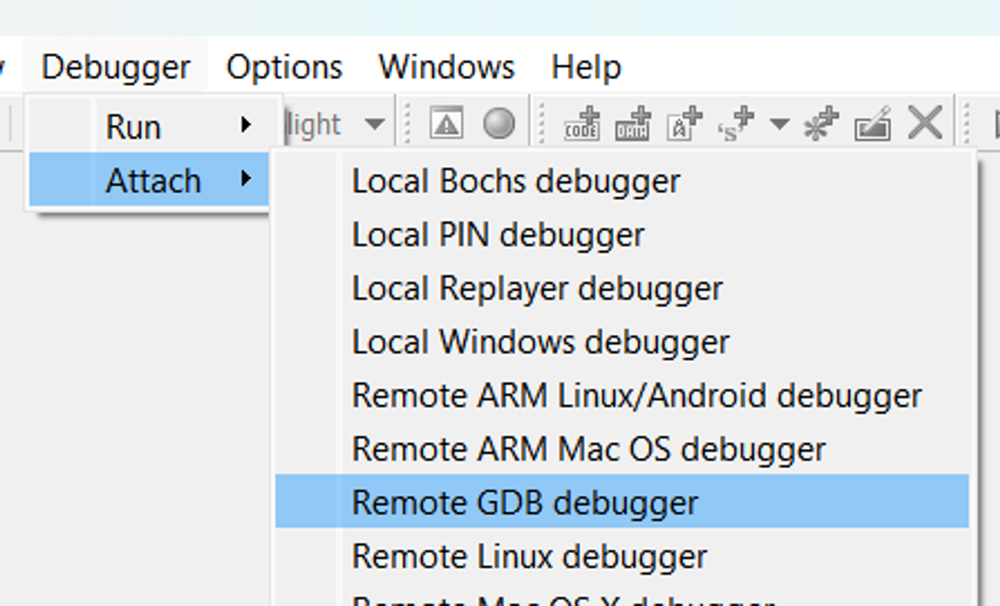

Debugger -> Attach -> Remote GDB debugger

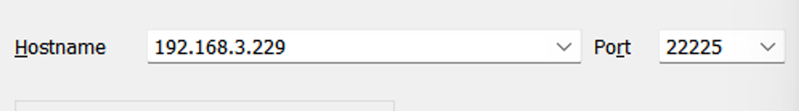

Configure hostname (IP address of Nintendo Switch), port (default is 22225)

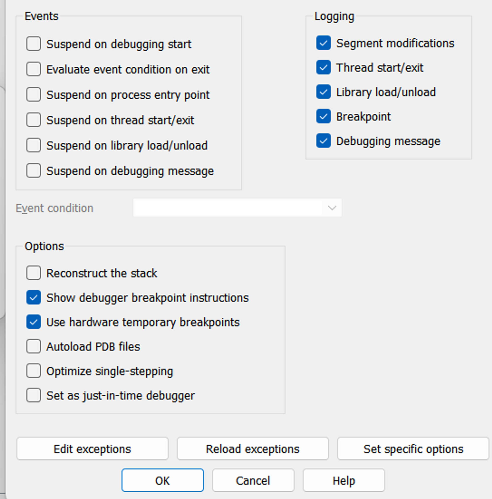

Debug options -> check the above options

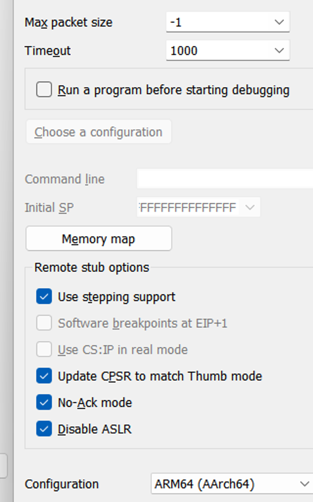

set specific options -> Configuration -> ARM64 (AArch64)

Now, run the game on the console.

Then, come back to IDA and click ok. This will show you a windows with a list of process IDs.

Choose Application PID to attach to the console.

## Debugging on Yuzu

---

**Two things are needed to run Switch games on yuzu [^1].**

1. [XCI/NSP file](#merge-split-xcinsp)
2. [Keys](#yuzu-key-파일-설정)

### Merge Split XCI/NSP

---

By default, when XCI or NSP file is dumped, they will be split into files since the SD card uses FAT32 file format and this can hold only upto 4GB per file. Therefore, it is necessary to merge this files to create a single file to run on Yuzu. (Here we have chose XCI but you can just NSP as well.)

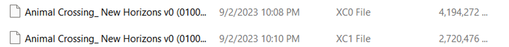

In the case above, the XCI file is divided into two parts.

In order to merge the files, follow the steps below.

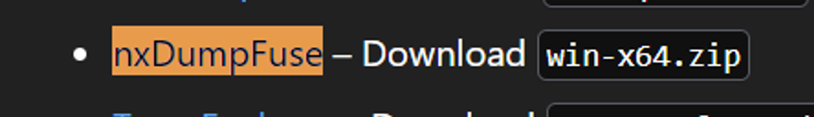

**Download the above program[^2].**

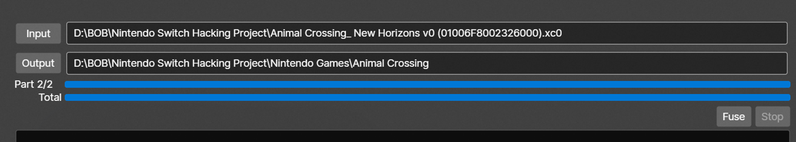

After running the program, click on input and select the XCI file numbered 0

Then, click on output and select a folder to output. 

Click on fuse and the files should have merged to produce a single file like below. 

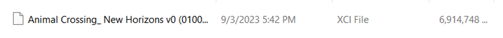

### yuzu key configuration

---

In order to play games on yuzu, you have to give prod.keys.

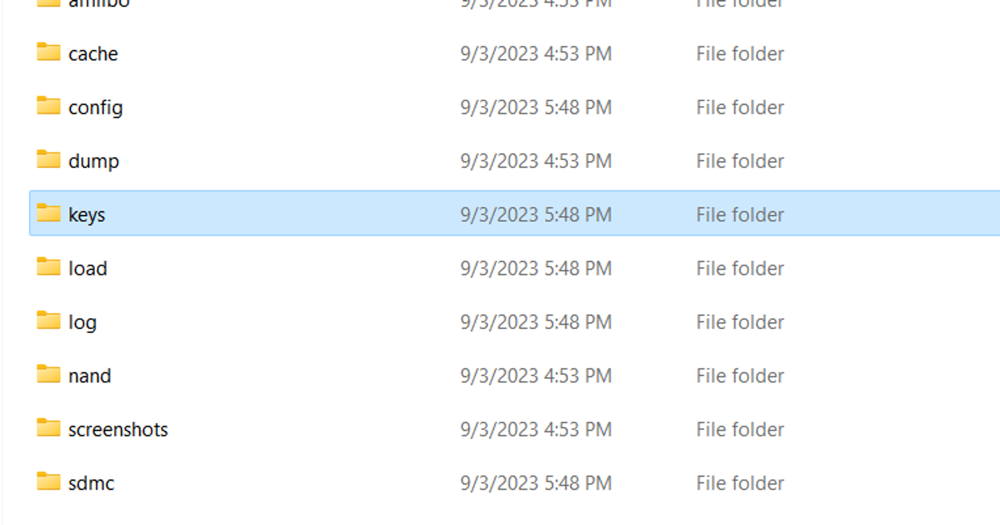

Go to ****yuzu folder and click on keys folder. (If you don't have one, make one.)

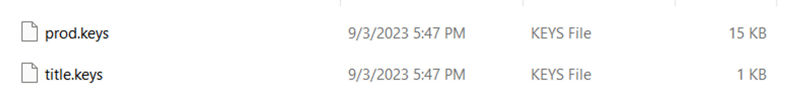

You can put the prod.keys file in this location.

### Run XCI/NSP on yuzu

---


After running yuzu, press **Add New Game Directory**, and select the game folder.

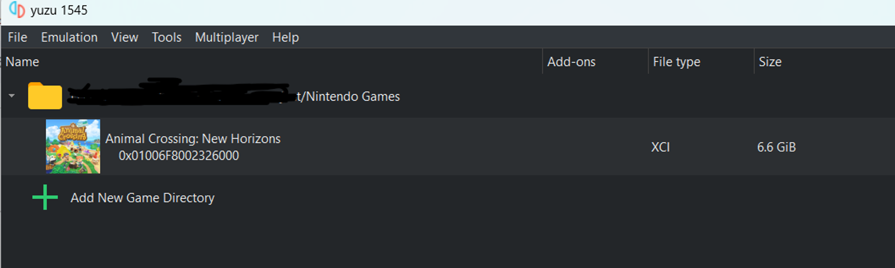

Now you should see a screen like above. Click on the game to play.

### Update Game

---

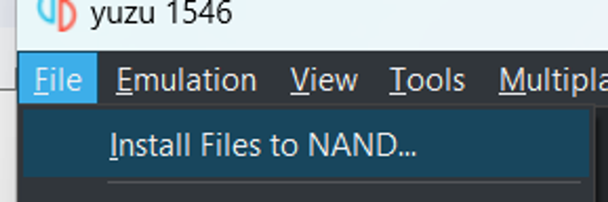

Click on **file -> install files to NAND** and choose the UPD file to update the game to the latest version.

## IDA debug

---

In order to debug on yuzu, you have to enable gdb stub.

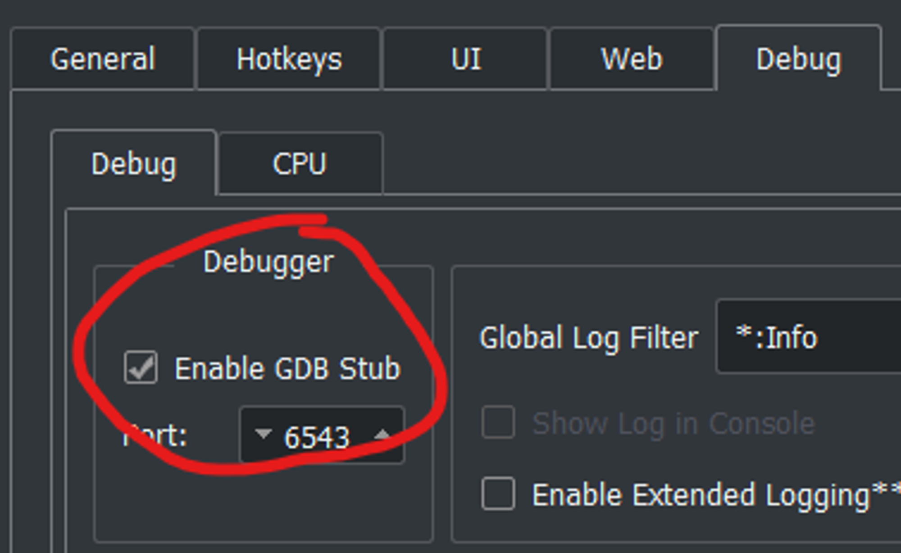

From yuzu, go to Emulation → configure → general → debug and specify the port you want in the red circle.

Then, follow the same steps for IDA debugging above.

(ip addr = 127.0.0.1, port = 6543)

Now, if you run a game on yuzu, it will stop at "lauching…" screen.

This means that it is waiting for gdb to attach.

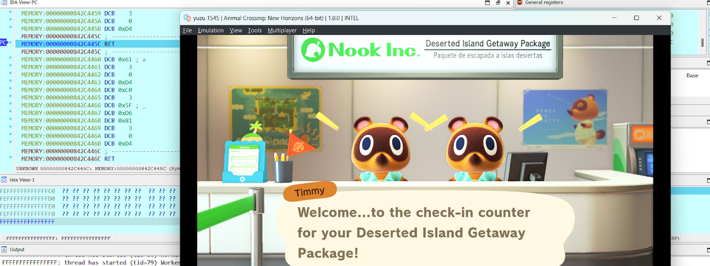

Attach to the game using IDA like above. (Here you won’t see application pid but only pid for yuzu)

## Rebase Program

---

### yuzu

---

Find the base address. (You can use the “get info” command in IDA .)


edit→Segments→Rebase program

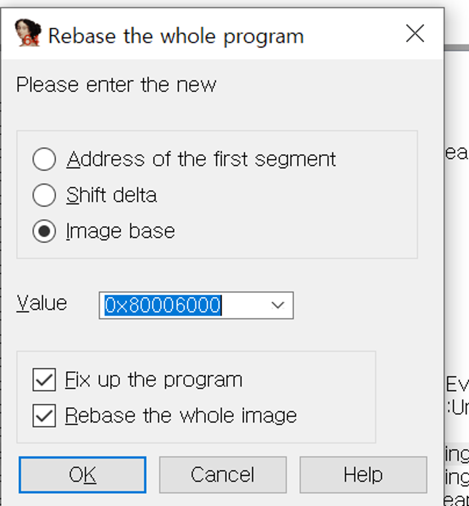

Enter the base address and the program will be rebased to that address. 

[^1]: https://yuzu-emu.org/help/quickstart/
[^2]: https://github.com/oMaN-Rod/nxDumpFuse/releases/tag/v1.0.3
