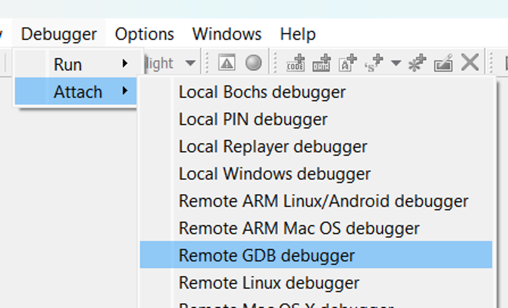
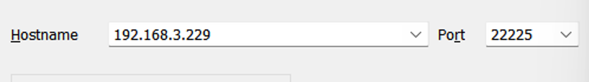
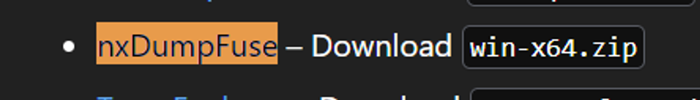
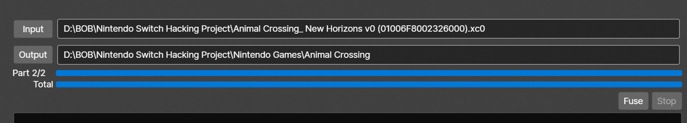
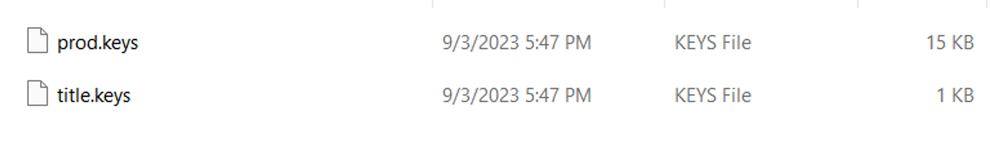
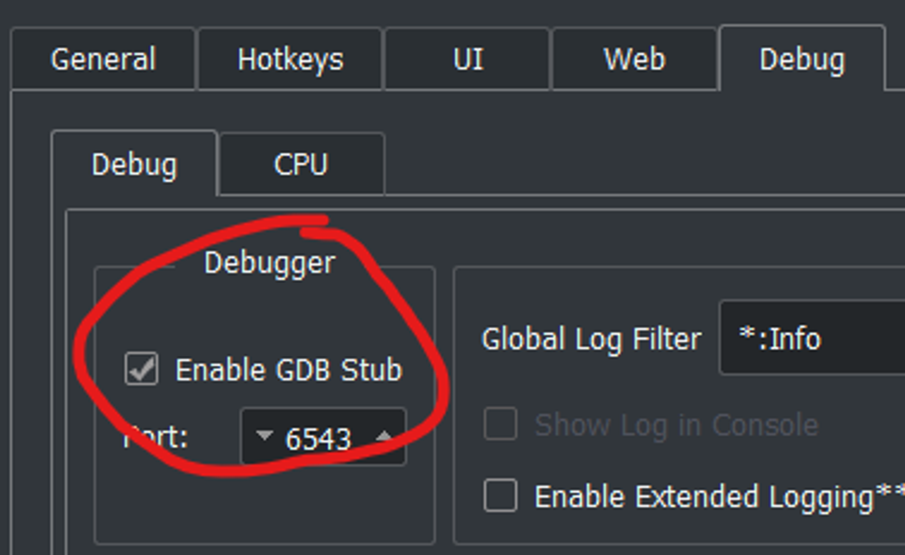
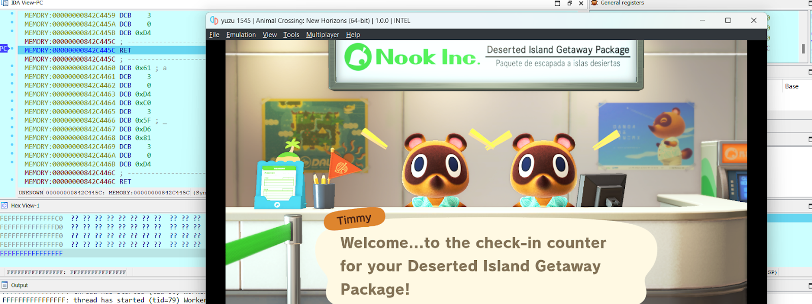
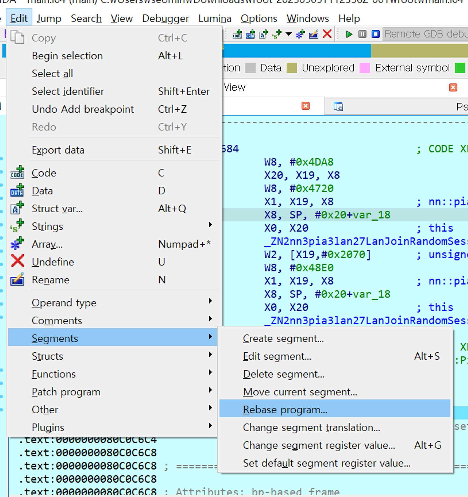

# 디버깅 환경 구성

---

# 개요

동적 분석을 위한 방법을 정리한다.

# 내용

## 사전 준비

### Atmosphere 설치

일반적인 닌텐도 스위치는 디버거 연결이 불가능하므로, 디버거 연결 기능을 지원하게 만들어주는 Atmosphere를 닌텐도 스위치에 설치한다.

### Atmosphere 설정

Atmosphere가 설치된 SD 카드의 /atmosphere/config/system_settings.ini에 다음과 같은 내용을 추가한다.

```
[atmosphere]
enable_htc = u8!0x0
enable_standalone_gdbstub = u8!0x1
```

### GDB 설치

닌텐도 스위치는 arm 아키텍쳐이므로, arm 아키텍쳐를 디버깅할 수 있는 GDB가 필요하다. 따라서 멀티 아키텍쳐를 지원하는 GDB를 설치한다.

```bash
sudo apt-get install -y gdb-multiarch
```

## 게임 디버깅

### GDB 연결

닌텐도 스위치와 GDB가 깔린 컴퓨터를 같은 인터넷에 연결한 뒤, 스위치의 IP를 알아낸다(System Setting -> Internet -> Connection Status -> IP Address). 그리고 다음과 같이 명령어를 친다.

```bash
gdb-multiarch
target extended-remote <switch ip>:22225
monitor wait application
```

그 뒤, 닌텐도 스위치에서 게임을 킨다. 그러면 GDB에 다음과 같이 뜬다.

```
Send `attach 0xNN` to attach.
```

그러면 `attach 0xNN`에 해당하는 명령어를 그대로 입력하면 GDB로 스위치 게임을 분석할 수 있다.

## IDA 연결(버전 7.7 기준)



Debugger -> Attach -> Remote GDB debugger



hostname, port 설정하기


Debug options -> check the above options


set specific options -> Configuration -> ARM64 (AArch64)

Application (게임) 실행

ok 누르면 Application PID가 보임

Application PID 누르면 디버깅 환경 끝

## yuzu로 게임 디버깅

yuzu에서 스위치 게임을 실행하기 위해서는 2가지가 필요하다[^2].

1. [XCI/NSP 파일](#merge-split-xcinsp)
2. [Keys](#yuzu-key-파일-설정)

### Merge Split XCI/NSP

어차피 둘 다 NCA를 담은 container라 XCI, NSP 둘 다 사용해도 된다. 

XCI를 dump할 때 나눠서 저장할지에 대한 option이 있을 것이다. 그게 default로 yes여서 아마 xci파일이 나눠서 나온다. (4gb 이상일 때 나뉜다)


XC0,1,2,3…

여기선 0하고 1밖에 없다



위 프로그램을 다운로드한다[^3].



실행할 후 input에 쪼개진 xci 파일의 0번을 고르고 output에 폴더를 고른 후 fuse를 누르면 된다. 밑은 결과로 나온 파일이다.


### yuzu key 파일 설정


yuzu 폴더에 들어가서 keys 폴더에 들어간다. (없으면 만든다.)



해당위치에 keys를 넣어주면 된다.

### Run XCI/NSP on yuzu


yuzu를 실행하고 Add New Game Directory를 누르고 게임폴더를 선택하면 된다.


그럼 위처럼 되고 게임을 눌러서 실행하면 된다.

### Update 게임

추출한 UPD, DLC 파일을 가지고 온다.


file -> install files to NAND를 누르고 UDP 또는 DLC 파일을 클릭하면 된다.

## IDA debug

debug를 활성화 해야한다.



yuzu에서 Emulation → configure → general → debug로 들어가 빨간 원에서 원하는 포트를 지정하면 된다. 

여기서 원하는 포트 지정한다.

그리고 위에서 한 ida 디버깅이랑 똑같다.

ip addr = 127.0.0.1, port = 6543

yuzu에서 겜을 실행하면 “lauching…”에서 멈춘다.

gdb attach를 기다리고 있는 것이다.



위에 있는 [방법](#ida-연결버전-77-기준)대로 연결하면 된다. 

suspend로 break point를 설정하고 디버깅을 할 수 있다.

## 코드 재배치

### yuzu

base 주소를 계산한다. (get info 명령어를 쓰면 나온다.)



edit→Segments→Rebase program을 누른다. 


위에서 Value에 계산한 값을 넣으면 정확한 위치에서 재배치가 된다.

[^1]: https://yuzu-emu.org/help/quickstart/
[^2]: https://github.com/oMaN-Rod/nxDumpFuse/releases/tag/v1.0.3
