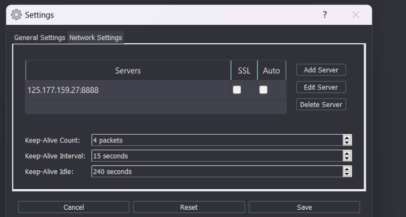

# Setup IDArling[^1]

---

# Overview

---

This article is about how to construct a static analysis environment using the IDA collaboration plug-in.

# Content

---

### Server Setup

---

To communicate with the server, you have to open ****the port on ufw, and proceed with port forwarding on the router.

```bash
git clone [https://github.com/fidgetingbits/IDArling](https://github.com/fidgetingbits/IDArling)
cd IDArling
pip3 install -r requirements.txt
pip3 install pyqt5 pyqt5-tools
sudo python3 setup.py install
sudo python3 setup.py build
```

Save file below in /etc/systemd/system/idaserver.service.

```bash
[Unit]
Description=Ida Server
After=syslog.target network.target network-online.target

[Service]
User=root
ExecStart=/usr/bin/python3 /home/msh/IDArling/idarling_server.py -h 0.0.0.0 -p 8888 --no-ssl
WorkingDirectory=/home/msh
Restart=on-failure
RestartSec=10s

[Install]
WantedBy=multi-user.target
```

If there is a problem, it would likely be a problem with having not installed pyqt5. This problem can be solved by installing the package as below.

```python
python -m pip install pyqt5 --upgrade
```

### Client Setup

---

Move plugin.py file to the plugins folder of IDA (IDA/plugins). Then, if you turn on IDA, the plugin should be activated as below


Press the bar at the bottom, and add a server to use it.



[^1]: https://github.com/fidgetingbits/IDArling
