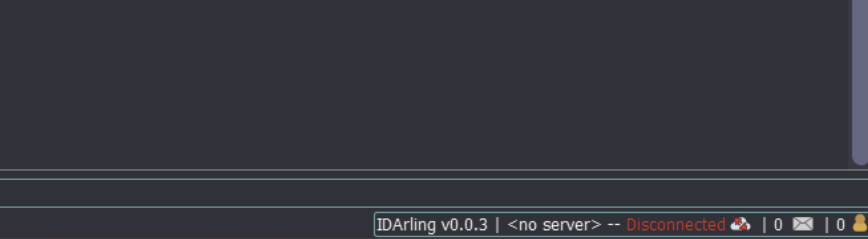
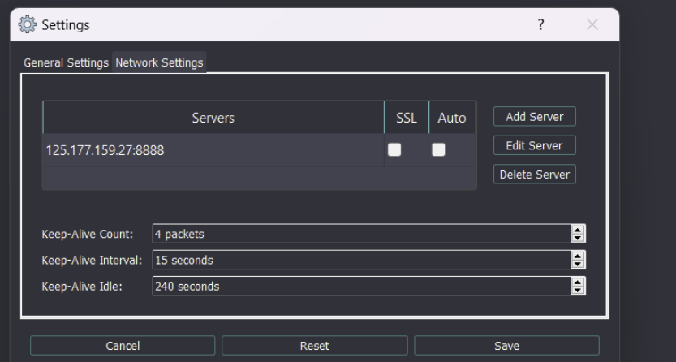

# IDArling[^1] 환경 구성

---

# 개요

IDA 협업 플러그인을 이용한 정적 분석 환경 구성하는 글이다.

# 내용

### Server Setup

ufw에서 포트를 열어주고, 공유기에서 포트포워딩을 진행했다.

```bash
git clone [https://github.com/fidgetingbits/IDArling](https://github.com/fidgetingbits/IDArling)
cd IDArling
pip3 install -r requirements.txt
pip3 install pyqt5 pyqt5-tools
sudo python3 setup.py install
sudo python3 setup.py build
```

/etc/systemd/system/idaserver.service에 service 파일을 추가한다.

```bash
[Unit]
Description=Ida Server
After=syslog.target network.target network-online.target

[Service]
User=root
ExecStart=/usr/bin/python3 /home/msh/IDArling/idarling_server.py -h 0.0.0.0 -p 8888 --no-ssl
WorkingDirectory=/home/msh
Restart=on-failure
RestartSec=10s

[Install]
WantedBy=multi-user.target
```

만약 문제가 생기면 아래처럼 설치하면 해결된다.

```python
python -m pip install pyqt5 --upgrade
```

### Client Set

`plugin.py`를 IDA/plugins 폴더로 옮겨주고 아이다를 키면 플러그인이 활성화 된다.



들어가서 하단에 바를 눌러주고 서버를 추가해서 사용하면 된다.



[^1]: https://github.com/fidgetingbits/IDArling
