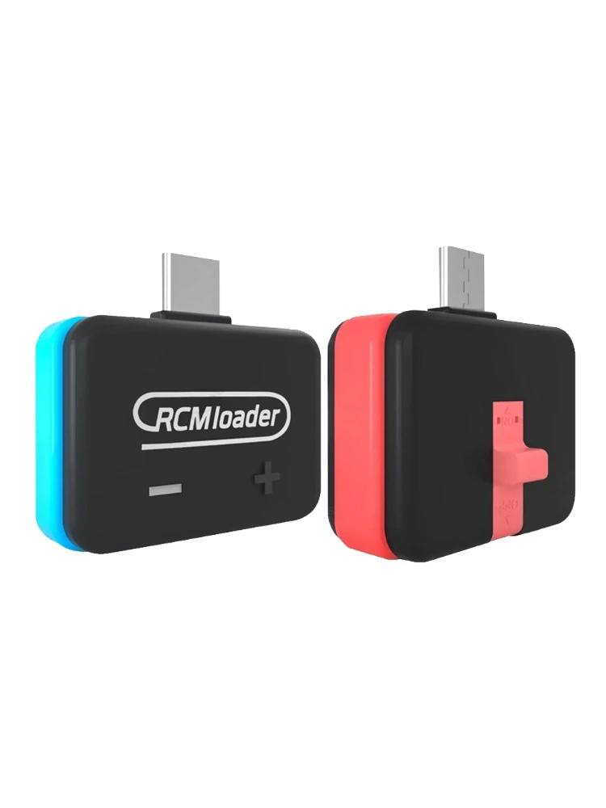

# Booting CFW(Hekate)

---

# Overview

---

In order to use the Homebrew and tools (hereinafter referred to as tools) installed in [Set Up Micro SD](../Set_Up_MicroSD/README.md) , it is necessary to boot the Nintendo Switch into custom firmware (hereinafter referred to as CFW). This article talks about how to boot CFW Hekate on a Nintendo Switch.

# Precaution

---

Nintendo Switch made after August 2018 can’t use CFW with this method[^1]. If it's a Nintendo Switch made after that, you can use CFW by attaching the SX (Hwfly) Core to the Switch [^2].

# What is Hekate?

---

Hekate is a custom bootloader and a CFW for Nintendo Switch [^3]. The main functions of Hekate are as follows.

- HOS (Switch OS) Bootloader -- For CFW Sys/Emu, OFW Sys and Stock Sys
- Payload Launcher
- eMMC/emuMMC Backup/Restore Tools

# **Booting CFW(Hekate)**

---

In order to boot the Nintendo Switch in CFW, you need to enter Recovery Mode (RCM). The tools you need to enter RCM are RCM Jig (required) and RCM Loader (optional). If you don't have a RCM Jig, you can make it through paper clips, and if you don't have an RCM Loader, you can connect with your PC and replace the Loader [^4].

## RCM Loader & Jig

Below is a picture of RCM loader and Jig.

The red piece on the left is the Jig which allows you to enter Recovery mode while on the right is the RCM loader which allows you to boot in CFW using the USB-C terminal.

## Booting CFW(Hekate)

---

Remove the right Joycon of the Nintendo Switch and insert the RCM Jig in that location. Insert the RCM Loader in the c type port and the setup is complete. 

To turn on the Switch, press the power button and volume increase button. When booted correctly, the following screen will appear.

[^1]: https://nh-server.github.io/switch-guide/faq/
[^2]: https://www.youtube.com/watch?v=IKTKaocvCW4
[^3]: https://github.com/CTCaer/hekate
[^4]: https://nh-server.github.io/switch-guide/user_guide/emummc/sending_payload/
