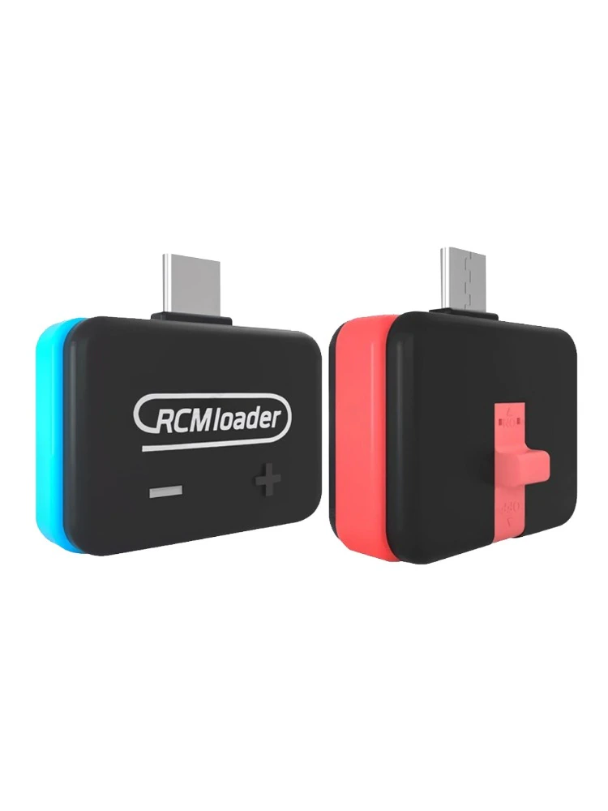
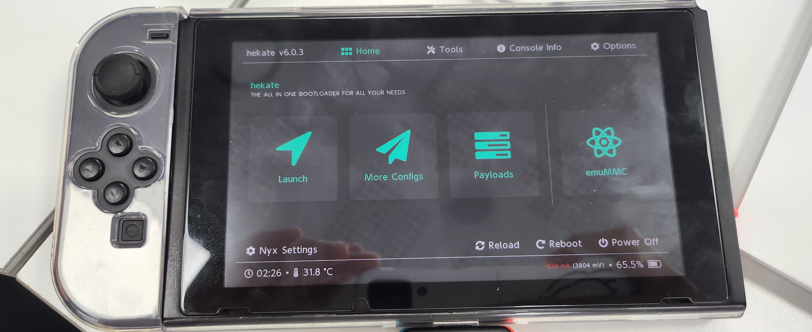

# CFW(Hekate) 부팅

---

# 개요

[Micro SD 카드 설정](/Set_Up_MicroSD/README_kor.md) 에서 설치한 홈브루(Homebrew) 및 도구들(이하 툴)을 사용하기 위해서는 닌텐도 스위치를 커스텀 펌웨어(이하 CFW)로 부팅할 필요가 있다. 이 글은 닌텐도 스위치에서 CFW 중 가장 유명한 Hekate를 부팅하는 방법에 대한 글이다.

# 주의

2018년 8월 이후에 만들어진 닌텐도 스위치는 바로 CFW를 사용하지 못한다[^1]. 만약 그 이후에 만들어진 닌텐도 스위치라면 SX(Hwfly) Core를 스위치에 부착하여 CFW를 사용할 수 있다[^2].

# Hekate란?

Hekate란 닌텐도 스위치용 커스텀 부트로더이자 펌웨어 패치 도구 등을 포함한 CFW이다[^3]. Hekate의 주요 기능은 다음과 같다.

- HOS (Switch OS) Bootloader -- For CFW Sys/Emu, OFW Sys and Stock Sys
- Payload Launcher
- eMMC/emuMMC Backup/Restore Tools

# **CFW(Hekate) 부팅**

닌텐도 스위치를 CFW로 부팅하기 위해서는 RCM(ReCovery Mode)로 진입할 필요가 있다. RCM로 진입하기 위해 필요한 도구는 RCM Jig(필수), RCM Loader(선택)이 있다. 만약 RCM Jig가 없다면 종이 클립을 통해 만들 수 있으며 RCM Loader가 없다면 PC와 연결하여 Loader를 대신할 수 있다[^4].

## RCM Loader & Jig

일반적인 RCM Loader와 Jig의 생김새는 다음과 같다.

사진에 있는 빨간색 스위치처럼 생긴 것이 RCM Jig이며 이를 통해 RCM으로 진입할 수 있다. 또한, RCM Loader에 있는 USB-C 단자를 이용하여 CFW를 부팅할 수 있다.

## CFW(Hekate) 부팅 방법

닌텐도 스위치의 오른쪽 조이콘을 빼고 해당 위치에 RCM Jig를 끼우고 RCM Loader를 끼운 뒤, 닌텐도 스위치의 전원 버튼과 음량 증가 버튼을 동시에 누르면 SD 카드에 있는 Hekate가 부팅된다. 정상적으로 부팅되면 다음과 같은 화면이 나타난다.

[^1]: https://nh-server.github.io/switch-guide/faq/
[^2]: https://www.youtube.com/watch?v=IKTKaocvCW4
[^3]: https://github.com/CTCaer/hekate
[^4]: https://nh-server.github.io/switch-guide/user_guide/emummc/sending_payload/