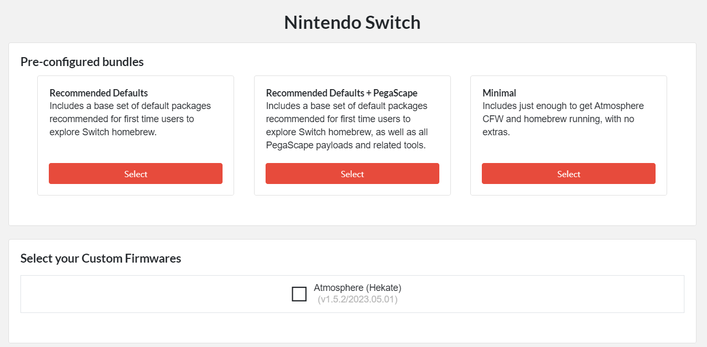

# Micro SD 카드 설정

---

# Overview

When installing custom firmware [^1] or any other software on a Nintendo Switch, it is necessary to put the executable file of the software into an SD card.

# SD Card Format

When using an SD card on a Nintendo switch, it is recommended that you set the SD card's file system to FAT32 [^2]. Therefore, if your SD card's file system is not FAT32, you can format it to FAT32 using tools such as HP USB Disk Storage Format Tool [^3].

# SD Card Structure

When trying to use a tool through an SD card, the structure of the SD card should be as follows.

```
F:.
├─atmosphere
│  ├─config
│  ├─config_templates
│  ├─fatal_errors
│  ├─flags
│  ├─hbl_html
│  │  └─accessible-urls
│  └─kip_patches
├─bootloader
│  ├─ini
│  ├─payloads
│  ├─res
│  └─sys
│      └─l4t
└─switch
    └─appstore
        └─.get
```

One way to deploy as above is to install an all-in-one package like Kefir [^4], but this document will explain using the “SD Setup” method.

## SD Setup Method

There are many users using CFW on Nintendo Switch and luckily someone has created a site to help with SD card configuration. By selecting the tool you want to use on a site called “SD Setup”, you can configure your SD card with the files you want with just few clicks[^5]. When you enter the SD Setup site, the following page appears.



Select the tools you want here, and click "Download your ZIP" at the bottom of the screen to download the file. Now, open the downloaded file and transfer the files in /payloads to /sd/bootloader. Finally, move all files under /sd to the SD card with FAT32 file system.

## Update

If the tool downloaded from SD Setup is not the latest version, you can directly receive the latest version and replace it. Each tool may have different installation methods, so it should be replaced by referring to each tool's download site.

[^1]: https://wiki.gbatemp.net/wiki/List_of_Switch_custom_firmwares#ReiNX
[^2]: https://www.reddit.com/r/NintendoSwitch/comments/ekzbdo/exfat_vs_fat_32_whats_safest/
[^3]: https://blog.kakaocdn.net/dn/ub7ri/btqIwEuwnvs/PSQ1wHFZh9EtIiqqYTQMc1/HPUSBDisk.exe?attach=1&knm=tfile.exe
[^4]: https://codeberg.org/rashevskyv/kefir/releases
[^5]: https://www.sdsetup.com/console?switch