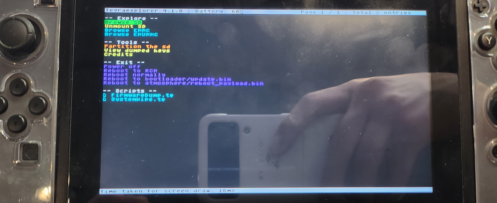

# 펌웨어 추출

---

# 개요

이 글은 Hekate가 부팅된 닌텐도 스위치에서 펌웨어를 추출하는 방법을 설명한다.

# 펌웨어 추출 방법

닌텐도 스위치에서 펌웨어를 추출할 때는 TegraExplorer를 사용한다[^1].

## TegraExplorer 설치 방법

TegraExplorer의 TegraExplorer.bin 파일을 SD카드의 bootloader/payloads에 넣는다.

## TegraExplorer 사용 방법

hekate를 부팅한 뒤, payload ->TegraExplorer.bin을 실행한다. TegraExplorer가 켜진 화면은 다음과 같다.

그리고 Scripts -> FirmwareDump.te -> Dump (SysMMC/EmuMMC)를 실행한다. 추출된 펌웨어는 SD 카드의 tegraexplorer/Firmware/(버전)/에 저장된다.

# 참고자료

[^1]: https://github.com/suchmememanyskill/TegraExplorer