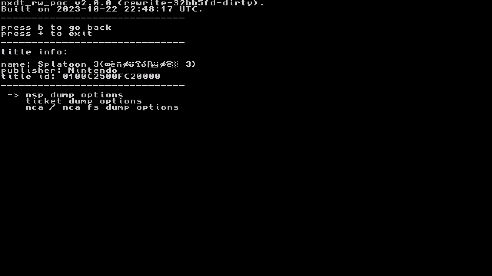

# Extract Game File

---

# Overview

It is necessary to extract game files to analyze RomFS or ExeFS of the game or run the game on an emulator such as yuzu. Game-related files that can be extracted include ExeFS, RomFS, NSP, and XCI.

- ExeFS: a file containing game instructions. Since it is generally compressed, decompression is necessary for easier analysis.
- RomFS: A file containing resources used in the game.
- NSP, XCI: A file used to play the game.

To dump these files, NXDumpTool is used[^1]. This article describes how to extract game files from Nintendo Switch booted into CFW.

# NXDumpTool

### Installation

Download the NRO file from NXDumpTool and place it in switch/nxdumptool/nxdumptool.nro on the SD card.

### Instructions

If you run NXDumpTool in Homebrew, you can choose whether to dump from gamecard or dump from SD card or eMMC.


If you dump from gamecard, you are dumping the data from the gamecard you plugged into the Nintendo Switch, and you can dump the game installed on the device.



# Dumping Gamecard Content

Select the "Dump gamecard content" option to dump the data of the gamecard plugged into the Switch.

- Requires /switch/prod.keys

## Dumping ExeFS Section

ExeFS can be dumped by choosing **ExeFS options -> ExeFS section data dump**. The detailed settings are as follows.

```
Split files bigger than 4 GiB (FAT32 support): Yes
```

**The extracted files are located at switch/nxdumptool/ExeFS/(game name)/* on the SD card.**


## Dumping NSP Files

You can dump NSP files by choosing **Nintendo Submission Package (NSP) dump -> Start NSP dump process**. The detailed settings are as follows.

```
Split files bigger than 4 GiB (FAT32 support): Yes
```

**The extracted files are located at switch/nxdumptool/NSP/(game name)/[N+] on the SD card.**


## Dumping XCI Files

You can dump XCI files by choosing **NX Card Image (XCI) dump -> Start XCI dump process**. The detailed settings are as follows.

```
Split files bigger than 4 GiB (FAT32 support): Yes
Keep certificate: No
CRC32 checksump calculation + dump verification: No
```

**The extracted files are located at switch/nxdumptool/XCI/(game name).xc[N+] on the SD card.**


# Dumping e-shop/update Content

Select "Dump installed SD card / eMMC content" option to dump update files or e-shop data. If you have the gamecard plugged in, you will get a line saying "No base application available in the SD card / MMC storage" and no game may appear. In this case, you can then press Y to extract only the update file.


## Dumping ExeFS Section

You can dump ExeFS by choosing **ExeFS options -> ExeFS section data dump**. The detailed settings are as follows.

```
Split files bigger than 4 GiB (FAT32 support): Yes
```

**The extracted files are at switch/nxdumptool/ExeFS/(game name)/* on the SD card.**

## Dumping NSP

You can extract NSP files by pressing **Nintendo Submission Package (NSP) dump -> Start NSP dump process**. The detailed settings are as follows.

```
Split files bigger than 4 GiB (FAT32 support): Yes

Remove console specific data: No

Dump delta fragments: No
```

**The extracted files are at switch/nxdumptool/NSP/(game name).nsp on the SD card.**

# Reference

[^1]: https://github.com/DarkMatterCore/nxdumptool