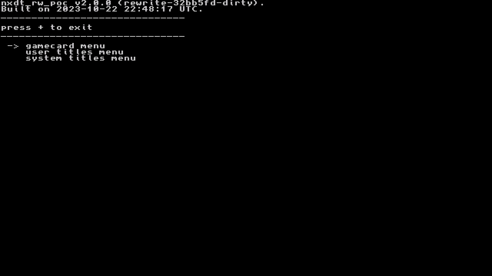
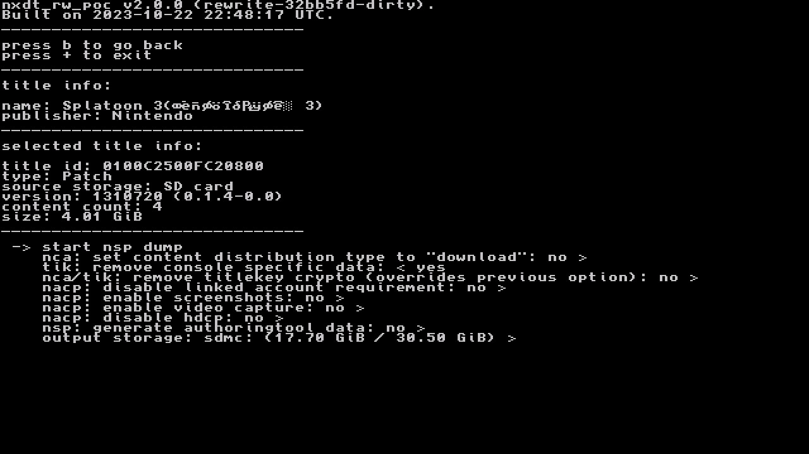

# 게임 파일 추출

---

# 개요

게임의 RomFS나 ExeFS를 분석하기 위해, 또는 yuzu 등의 에뮬레이터로 돌리기 위해서는 게임 파일을 추출할 필요가 있다. 추출할 수 있는 게임 관련 파일은 ExeFS, RomFS, NSP, XCI 등이 있다.

- ExeFS: 실제 게임의 명령어들이 담긴 파일이다. 일반적으로 압축되어 있어, 분석의 용이함을 위해 압축 해제가 필요하다.
- RomFS: 게임에서 사용하는 리소스들이 담긴 파일이다.
- NSP, XCI: 실제 게임을 하는데 사용하는 파일이다.

이러한 파일을 추출하기 위해서는 NXDumpTool을 사용한다[^1]. 이 글은 CFW로 부팅된 닌텐도 스위치에서 게임 파일을 추출하는 방법을 설명한다.

# NXDumpTool

### 설치

NXDumpTool의 nro 파일을 다운로드 받아 SD카드의 switch/nxdumptool/nxdumptool.nro에 위치하게 만든다.

### 사용법

홈 브루에서 NXDumpTool을 키면 gamecard에서 덤프를 할지, SD카드나 eMMC에서 덤프를 할지 선택할 수 있다.



gamecard에서 덤프를 하면 실제로 닌텐도 스위치에 꽂은 칩과 관련하여 덤프를 하는 것이고, 기기에 설치된 게임을 덤프할 수 있다.


# 칩 데이터 추출

실제로 스위치에 꽂은 게임의 데이터를 추출하려면 “Dump gamecard content” 옵션을 선택한다.

- /switch/prod.keys 필요

## ExeFS 추출

ExeFS options -> ExeFS section data dump를 눌러 ExeFS를 추출할 수 있다. 세부 설정은 다음과 같다.

```
Split files bigger than 4 GiB (FAT32 support): Yes
```

추출된 파일은 SD카드의 switch/nxdumptool/ExeFS/(게임명)/*이다.

[Exefs_1](img/Exefs_1.png)

## NSP 추출

Nintendo Submission Package (NSP) dump -> Start NSP dump process를 눌러 NSP 파일들을 추출할 수 있다. 세부 설정은 다음과 같다.

```
Split files bigger than 4 GiB (FAT32 support): Yes
```

추출된 파일은 SD카드의 switch/nxdumptool/NSP/(게임명)/[N+]이다.

[NSP_1](img/NSP_1.png)

## XCI 추출

NX Card Image (XCI) dump -> Start XCI dump Process를 눌러 XCI 파일들을 추출할 수 있다. 세부 설정은 다음과 같다.

```
Split files bigger than 4 GiB (FAT32 support): Yes
Keep certificate: No
CRC32 checksump calculation + dump verification: No
```

추출된 파일은 SD카드의 switch/nxdumptool/XCI/(게임명).xc[N+]이다.

[XCI_1](img/XCI_1.png)

# 업데이트 / e-shop 데이터 추출

업데이트 파일이나 e-shop 데이터를 추출하려면 “Dump installed SD card / eMMC content” 옵션을 선택한다. 만약 칩을 꽂아 게임을 한다면, “No base application available in the SD card / MMC storage”라는 문구가 뜨면서 아무런 게임도 안 뜰 수 있다. 그러면 Y 키를 눌러 업데이트 파일만 추출할 수 있다.



## ExeFS 추출

ExeFS options -> ExeFS section data dump를 눌러 ExeFS를 추출할 수 있다. 세부 설정은 다음과 같다.

```
Split files bigger than 4 GiB (FAT32 support): Yes
```

추출된 파일은 SD카드의 switch/nxdumptool/ExeFS/(게임명)/*이다.

## NSP 추출

Nintendo Submission Package (NSP) dump -> Start NSP dump process를 눌러 NSP 파일들을 추출할 수 있다. 세부 설정은 다음과 같다.

```
Split files bigger than 4 GiB (FAT32 support): Yes

Remove console specific data: No

Dump delta fragments: No
```

추출된 파일은 SD카드의 switch/nxdumptool/NSP/(게임명).nsp이다.

# 참고자료

[^1]: https://github.com/DarkMatterCore/nxdumptool