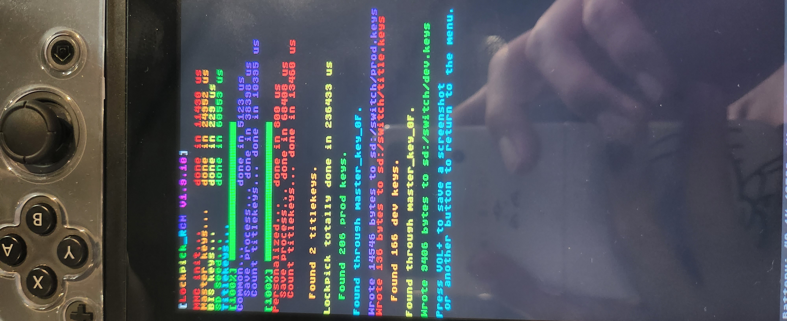

# Extract Key File 

---

# Overview

---

To analyze/emulate games or firmware extracted from Nintendo Switch, it is necessary to extract prod.keys and Title.keys (hereinafter referred to as keys). This article explains how to extract keys from Nintendo switches where Hekate is booted.

# Dumping key files

---

In order to dump key files in Nintendo Switch we will use Lockpick_RCM [^1].

## Lockpick_RCM Installation

---

Download Lockpick_RCM and put Lockpick_RCM.bin under bootloader/payloads folder of the SD card.

## Lockpick_RCM Usage

---

After booting into Heckate, choose payload ->Lockpick_RCM.bin. The keys can be dumped by selecting either "Dump from SysNAND" or "Dump from EmuNAND". The extracted files will be located at switch/*.keys on the SD card.

[^1]: https://github.com/Decscots/Lockpick_RCM
