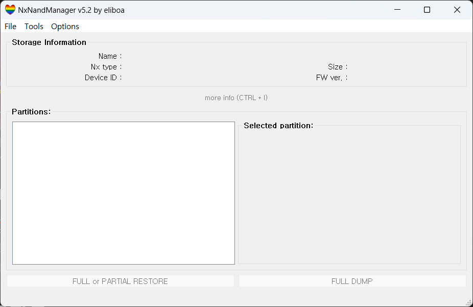
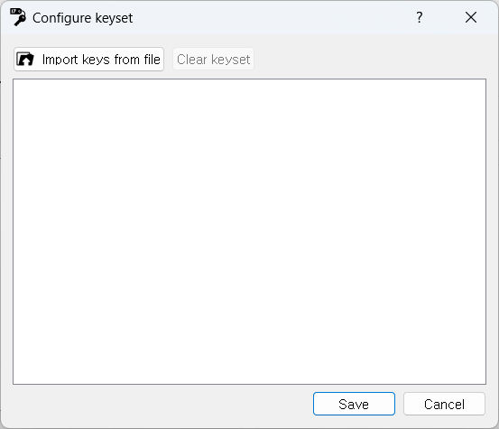
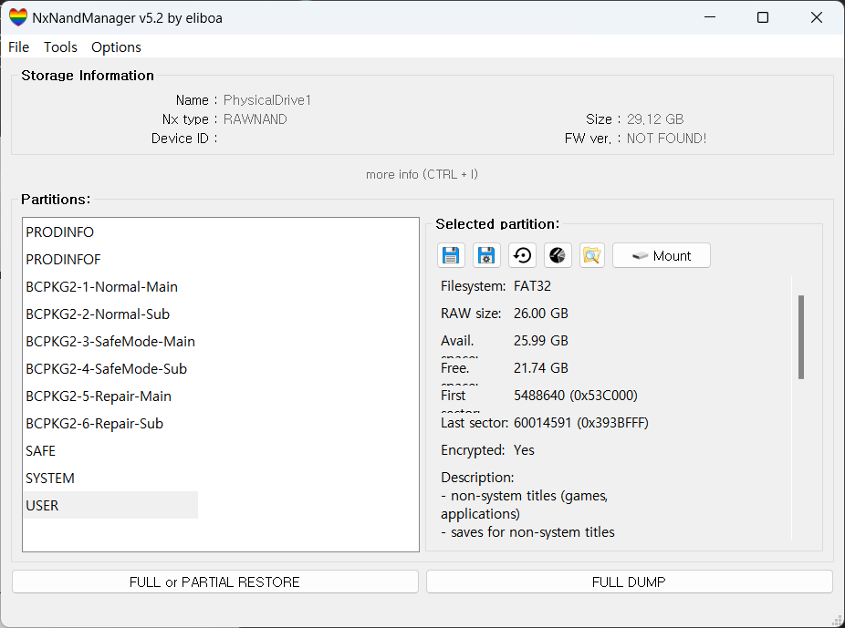

# Extract Save File

---

# Overview

This article explains how to dump the game save files in Nintendo Switch using CFW.

# How to Dump Save Files

## Nintendo Switch

The Nintendo Switch save files are stored in NAND. Therefore, data from games played in SysNAND (SysMMC) is stored in SysMMC, and data from games played in EmuNAND (EmuMMC) is stored in EmuMMC.

To dump the save file stored in each MMC, enter RCM and boot into Hekate. After that, when you enter Tools → USB Tools, the following screen appears.


Here, select "eMMC RAW GPP" if you want to extract SysMMC's save file, or "emu RAW GPP" if you want to extract EmuMMC's save file.

## NxNandManager[^1]

After selecting RAW GPP you want on your Nintendo Switch, you will need to access the file on your PC to extract it. This requires a tool called NxNandManager[1]. After downloading and running this tool, the following screen will appear.



In order to use this tool, it is necessary to add a key first. Select Option → Configure keyset and the following screen will appear.



Click on “Import keys from file”, and choose “prod.key”. Then, when you click on **File → Open drive**, different results will appear depending on the selected MMC type. If you select the topmost sector, you will see the following screen.



Select USER and click the icon that looks like File Explorer (5th icon under “Selected partition:”). Then, you can save them by pressing the save button in the window will appear.


Alternatively, tap the blue mark above and save the desired save file.

## Hactoolnet[^2]

After following the steps above, you will see files like below.


By using hactoolnet run following command using the key file.

```bash
<hactoolnet path>/hactoolnet.exe -t save -k <key path>/<key file> --outdir <save path> <extracted file>
```

List of ****reference commands

```
Save data                                                                                                        
--outdir <dir>       Specify directory path to save contents to.                                                        
--debugoutdir <dir>  Specify directory path to save intermediate data to for debugging.                                 
--sign               Sign the save file. (Requires device_key in key file)                                              
--trim               Trim garbage data in the save file. (Requires device_key in key file)                              
--listfiles          List files in save file.                                                                           
--repack <dir>       Replaces the contents of the save data with the specified directory.                               
--replacefile <filename in save> <file> Replaces a file in the save data
```

[^1]: https://github.com/eliboa/NxNandManager
[^2]: https://github.com/Thealexbarney/LibHac/releases