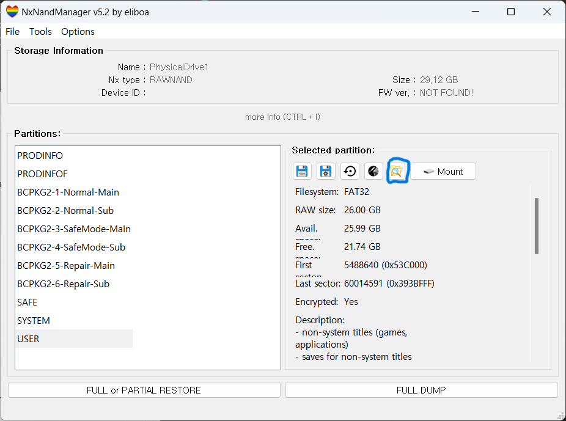

# 세이브 파일 추출

---

# 개요

이 글은 CFW가 깔린 닌텐도 스위치에서 게임의 세이브 파일을 추출하는 방법을 설명한 글이다.

# 세이브 파일 추출 방법

## 닌텐도 스위치

닌텐도 스위치의 세이브 파일은 NAND에 저장된다. 따라서 SysNAND(SysMMC)에서 플레이한 게임의 데이터는 SysMMC에 저장되고, EmuNAND(EmuMMC)에서 플레이한 게임의 데이터는 EmuMMC에 저장된다.

각 MMC에 저장된 세이브 파일을 추출하기 위해서는 RCM으로 진입한 후, Hekate를 실행시킨다. 그 뒤, Tools → USB Tools로 들어가면 다음과 같은 화면이 나타난다.


여기서 SysMMC의 세이브 파일을 추출하고 싶다면 “eMMC RAW GPP”를, EmuMMC의 세이브 파일을 추출하고 싶다면 “emu RAW GPP”를 선택한다.

## NxNandManager[^1]

닌텐도 스위치에서 자신이 원하는 RAW GPP를 선택했다면, PC에서 해당 파일에 접근하여 파일을 추출해야 한다. 그러기 위해서는 NxNandManager라는 툴이 필요하다[^1]. 이 툴을 다운로드 받은 뒤, 실행하면 다음과 같은 화면이 나온다.


이 툴을 사용하기 위해서, 우선 key를 추가할 필요가 있다. Option → Configure keyset을 선택하면 다음과 같은 화면이 나온다.


여기서 Import keys from file을 누르고, prod.keys를 불러온다. 그 뒤, File → Open drive를 누르면 선택한 MMC 종류에 따라 다른 결과가 나타난다. 거기서 가장 상단의 섹터를 선택하면 다음과 같은 화면이 나온다.


여기서 USER를 선택하고 파일 탐색기처럼 생긴 아이콘을 누른다. 그 뒤, 나타난 창에서 저장 아이콘을 눌러 전부 저장하면 된다.



아니면 위에 있는 파란색 표시를 누르고 원하는 세이브 파일을 보고 저장하면 된다.

## Hactoolnet[^2]

위에 결과로 밑 파일이 생성된다.


이를 hactoolnet을 이용해 키 파일과 함께 밑 명령어를 작성하면 된다.

```bash
<hactoolnet path>/hactoolnet.exe -t save -k <key path>/<key file> --outdir <save path> <extracted file>
```

참고한 명령어

```
Save data                                                                                                        
--outdir <dir>       Specify directory path to save contents to.                                                        
--debugoutdir <dir>  Specify directory path to save intermediate data to for debugging.                                 
--sign               Sign the save file. (Requires device_key in key file)                                              
--trim               Trim garbage data in the save file. (Requires device_key in key file)                              
--listfiles          List files in save file.                                                                           
--repack <dir>       Replaces the contents of the save data with the specified directory.                               
--replacefile <filename in save> <file> Replaces a file in the save data
```

[^1]: https://github.com/eliboa/NxNandManager
[^2]: https://github.com/Thealexbarney/LibHac/releases