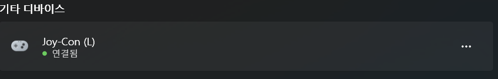
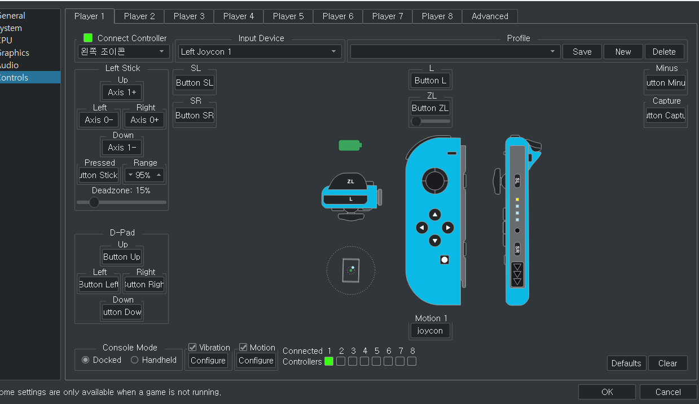

# Joycon connect on Yuzu

Press down on the round button on the side of Joycon until the green light turns on.

Press Add Device in bluetooth setting and add Joy-Con (L) and Joy-Con (R) like below. 

Now go to yuzu and run the game.

Under Emulation → Configure → Controls → Input Device, click Dual Joycon.

