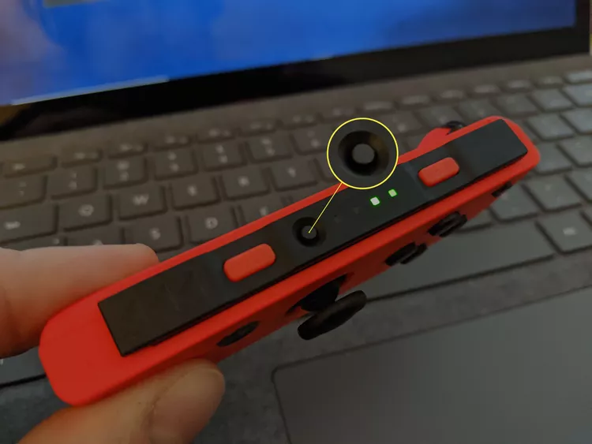
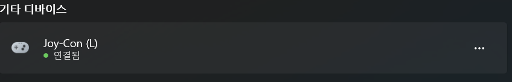
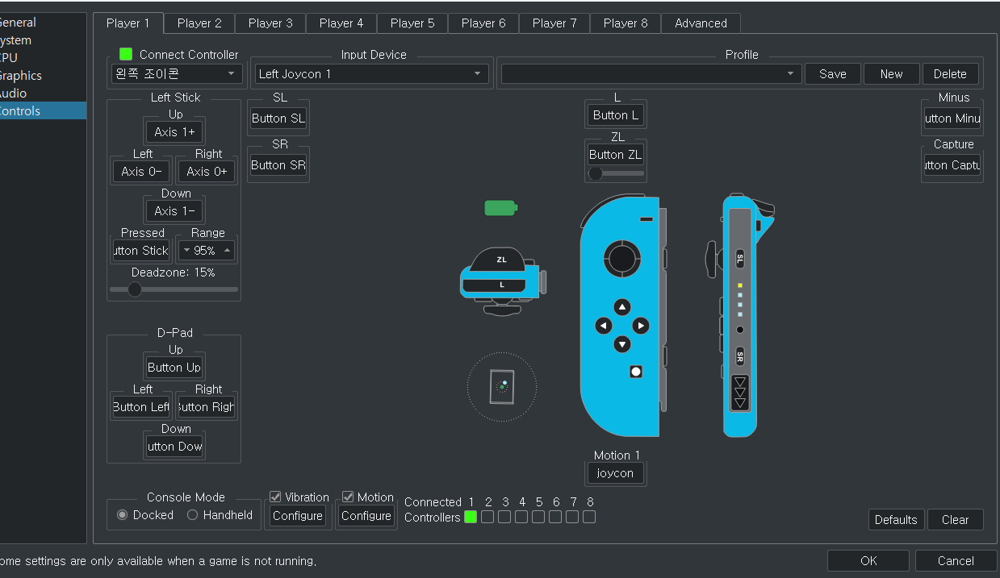

# Joy con connect

joycon side에 있는 동그란 친구를 초록 불이 뜰 때까지 꾹 눌러준다.

bluetooh에서 장치 추가를 누르고 bluetooth를 누르면 joycon left하고 right가 뜨면 추가하면 된다.

이제 yuzu로 가서 겜을 실행한다.

Emulation → Configure → Controls → Input Device에서 Dual Joycon을 클릭하면 된다.

